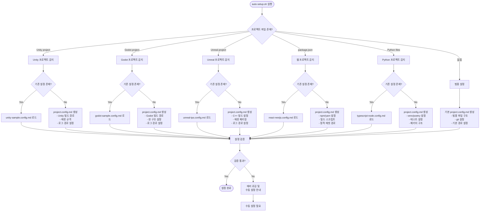

# A-001: 프로젝트 타입별 설정 플로우 다이어그램

## 개요
각 엔진/플랫폼별 auto-setup.sh 감지 흐름과 생성되는 설정 항목을 보여주는 플로우 다이어그램

## 다이어그램

## 감지 조건 상세

### Unity 프로젝트
- **감지 파일**: `Assets/`, `ProjectSettings/`, `*.unity`
- **생성 설정**:
  - 빌드 타겟 경로
  - 에셋 번들 설정
  - Unity 에디터 로그 경로

### Godot 프로젝트
- **감지 파일**: `project.godot`, `*.tscn`, `*.cs`
- **생성 설정**:
  - 익스포트 템플릿
  - 씬 구조 규격
  - Godot 에디터 로그 경로

### Unreal 프로젝트
- **감지 파일**: `*.uproject`, `Source/`, `Config/`
- **생성 설정**:
  - C++ 컴파일 설정
  - 패키지 빌드 경로
  - Unreal 에디터 로그 경로

### 웹 프로젝트
- **감지 파일**: `package.json`, `tsconfig.json`, `next.config.js`
- **생성 설정**:
  - npm/yarn 스크립트
  - 빌드 및 배포 경로
  - 정적 리소스 규격

### Python 프로젝트
- **감지 파일**: `requirements.txt`, `pyproject.toml`, `setup.py`
- **생성 설정**:
  - 가상환경 설정
  - 테스트 프레임워크
  - 패키지 의존성 관리

## 설정 파일 템플릿 매핑

| 프로젝트 타입 | 템플릿 파일 | 생성 위치 |
|-------------|------------|----------|
| Unity | `sample-config/unity-sample.config.md` | `project.config.md` |
| Godot | `sample-config/godot-sample.config.md` | `project.config.md` |
| Unreal | `sample-config/unreal-tps.config.md` | `project.config.md` |
| Web | `sample-config/react-nextjs.config.md` | `project.config.md` |
| Python | `sample-config/typescript-node.config.md` | `project.config.md` |
| 범용 | `sample-config/generic.config.md` | `project.config.md` |

## 검증 단계

1. **파일 존재성 확인**: 설정된 경로의 파일/폴더 존재 여부
2. **권한 확인**: 빌드 경로 쓰기 권한
3. **의존성 확인**: 필수 도구 설치 여부 (Unity Hub, Godot, npm 등)
4. **구문 검증**: project.config.md 마크다운 문법 및 필드 유효성

## 에러 처리

- **파일 미발견**: 수동 설정 안내 문서 출력
- **권한 부족**: sudo 권한 요청 또는 경로 변경 제안
- **의존성 누락**: 설치 가이드 링크 제공
- **구문 오류**: 오류 위치 및 수정 예시 제공