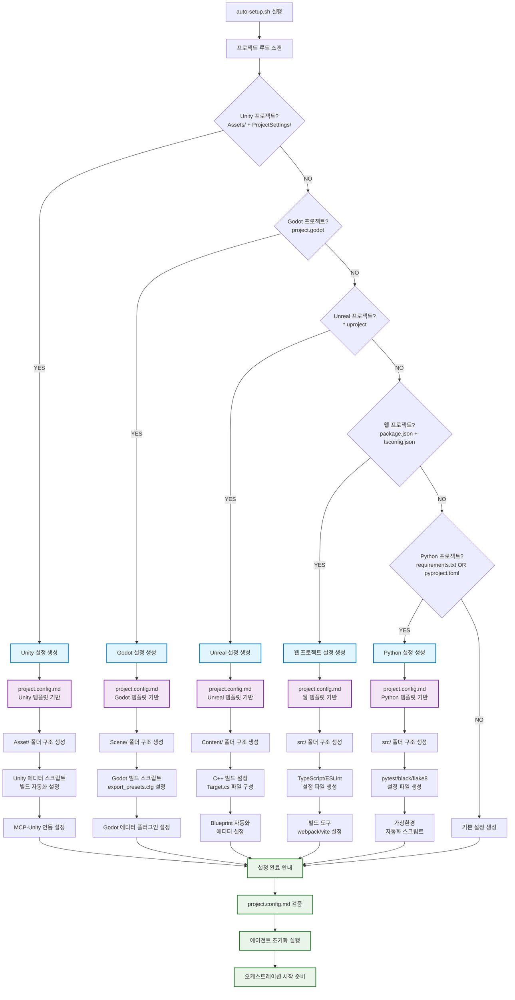

# A-001: 프로젝트 타입별 설정 플로우 다이어그램

## 개요
각 엔진/플랫폼(Unity, Godot, Unreal, Web, Python)별 auto-setup 감지 흐름과 생성되는 설정 항목을 보여주는 플로우 다이어그램.

## 플로우 다이어그램



## 감지 조건 상세

### Unity 프로젝트 감지
- **필수 파일/폴더**: `Assets/` + `ProjectSettings/`
- **추가 확인**: `ProjectSettings/ProjectVersion.txt`
- **생성 설정**: Unity 에디터 버전별 빌드 설정, 에셋 임포트 설정

### Godot 프로젝트 감지
- **필수 파일**: `project.godot`
- **추가 확인**: Godot 버전 정보
- **생성 설정**: Scene 기반 프로젝트 구조, GDScript/C# 설정

### Unreal Engine 프로젝트 감지
- **필수 파일**: `*.uproject` (프로젝트 파일)
- **추가 확인**: `Source/` 폴더 (C++ 프로젝트인 경우)
- **생성 설정**: Blueprint/C++ 혼합 설정, 패키징 설정

### 웹 프로젝트 감지
- **필수 파일**: `package.json` + `tsconfig.json`
- **추가 확인**: React/Next.js/Vue 등 프레임워크 감지
- **생성 설정**: 프론트엔드 빌드 체인, 타입스크립트 설정

### Python 프로젝트 감지
- **필수 파일**: `requirements.txt` OR `pyproject.toml` OR `setup.py`
- **추가 확인**: Python 버전, 가상환경 설정
- **생성 설정**: 패키지 관리, 테스트 프레임워크 설정

## 출력 파일

각 프로젝트 타입별로 생성되는 주요 파일들:

```
프로젝트루트/
├── project.config.md          # 프로젝트 설정 (엔진별 템플릿)
├── BOARD.md                   # 태스크 보드
├── BACKLOG_RESERVE.md        # 예비 태스크
├── agents/                    # 에이전트 설정
├── scripts/                   # 자동화 스크립트
└── sample-config/            # 참조용 설정 예시
```

## 관련 파일
- `auto-setup.sh` - 메인 설정 스크립트
- `sample-config/*.config.md` - 엔진별 설정 템플릿
- `specs/SPEC-R-006.md` - 웹 프로젝트 감지 스펙
- `specs/SPEC-R-007.md` - Python 프로젝트 감지 스펙