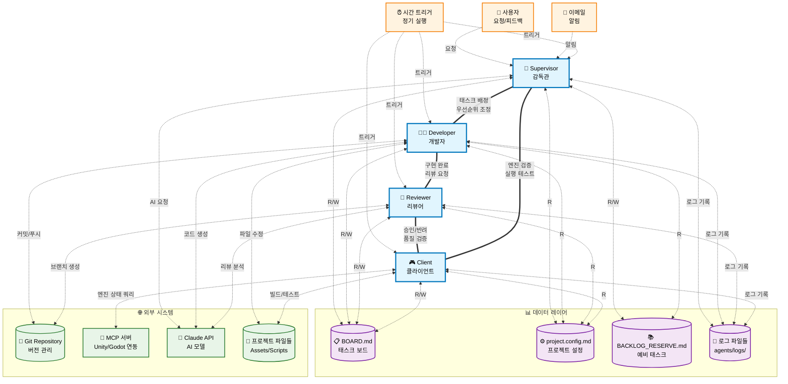
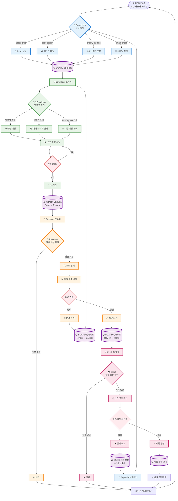
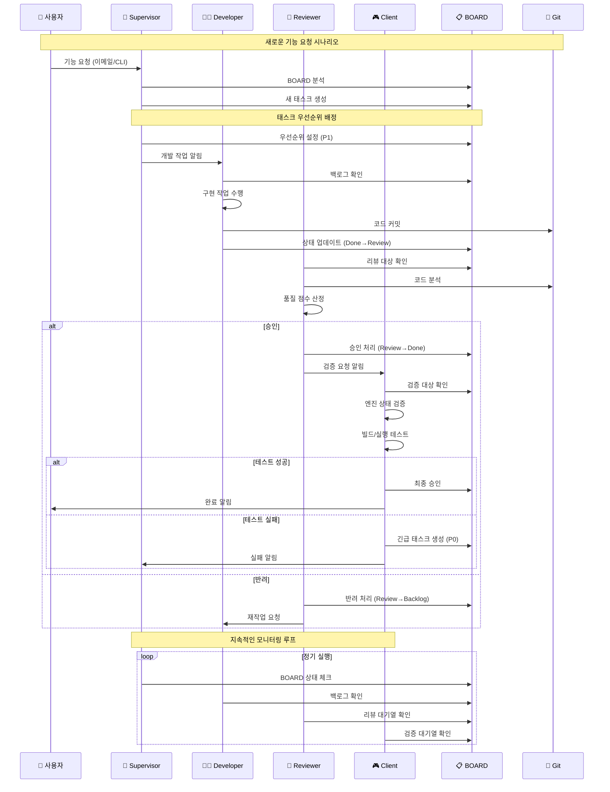
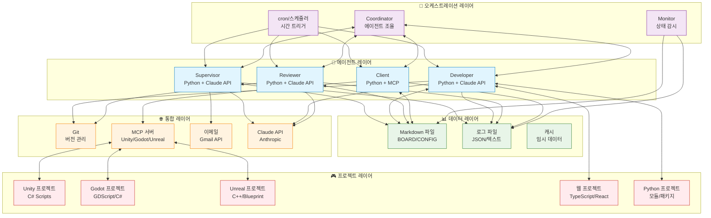

# A-003: 프로젝트 README 배너 및 아키텍처 다이어그램

## 개요
README.md용 프로젝트 배너 이미지, 4-에이전트 아키텍처 다이어그램, 태스크 생명주기 플로우차트 제작.

## 1. 프로젝트 배너 디자인

### ASCII 아트 버전 (텍스트 기반)
```
╔═══════════════════════════════════════════════════════════════╗
║                                                               ║
║    🎯 MULTI-AGENT ORCHESTRATION FRAMEWORK                   ║
║                                                               ║
║    ┌─────────┐  ┌─────────┐  ┌─────────┐  ┌─────────┐       ║
║    │ 👥 SUP  │──│ 👨‍💻 DEV │──│ 👀 REV  │──│ 🎮 CLI  │       ║
║    └─────────┘  └─────────┘  └─────────┘  └─────────┘       ║
║                                                               ║
║    Unity • Godot • Unreal • Web • Python 프로젝트 자동화    ║
║                                                               ║
╚═══════════════════════════════════════════════════════════════╝
```

### 컬러 버전 (마크다운 배지 스타일)
```markdown
<div align="center">

# 🎯 Multi-Agent Orchestration

<p>
  
  
  
  
  
</p>

**자율 에이전트가 관리하는 지능형 프로젝트 오케스트레이션 프레임워크**

*Autonomous • Scalable • Game-Engine Ready*

</div>
```

## 2. 4-에이전트 아키텍처 다이어그램



## 3. 태스크 생명주기 플로우차트



## 4. 시스템 컴포넌트 상호작용 다이어그램



## 5. 기술 스택 아키텍처



## 6. 배지 및 상태 표시

### 에이전트 상태 배지
```markdown


```

### 진행률 배지
```markdown


```

### 지원 플랫폼 배지
```markdown


```

## 7. 사용 예시

### README.md 헤더 예시
```markdown
<div align="center">

# 🎯 Multi-Agent Orchestration Framework

**자율 AI 에이전트로 구동되는 게임 개발 오케스트레이션**

[](LICENSE)
[](https://python.org)
[](https://claude.ai)


**지원 엔진**


---

*4개의 전문 AI 에이전트가 자율적으로 협업하여 프로젝트를 관리하고 개발합니다*

</div>
```

## 관련 파일
- `README.md` - 메인 프로젝트 문서
- `docs/architecture.md` - 상세 아키텍처 문서
- `docs/agent-specs.md` - 에이전트 역할 정의