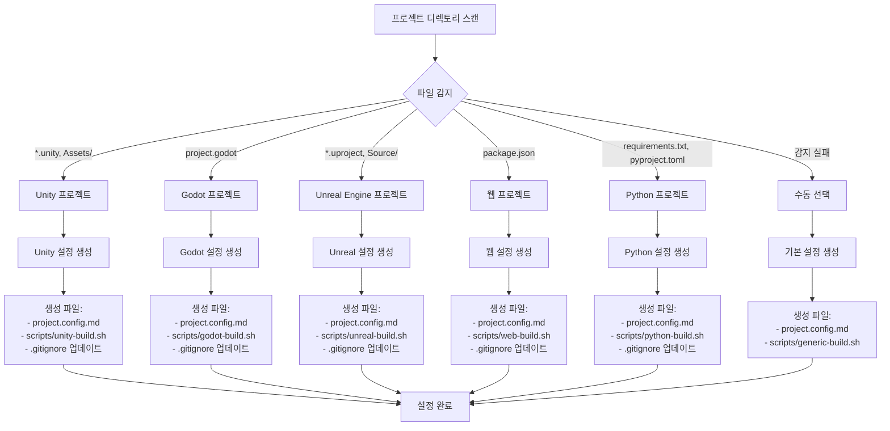

# 프로젝트 타입별 설정 플로우 다이어그램

## 개요
각 엔진/플랫폼(Unity, Godot, Unreal, Web, Python)별 auto-setup 감지 흐름과 생성되는 설정 항목을 보여주는 플로우 다이어그램

## 다이어그램



## 각 플랫폼별 감지 조건

### Unity
- **감지 파일**: `*.unity`, `Assets/` 디렉토리, `ProjectSettings/`
- **추가 확인**: `Library/`, `Temp/` 디렉토리 존재
- **버전 확인**: `ProjectSettings/ProjectVersion.txt`

### Godot
- **감지 파일**: `project.godot`
- **추가 확인**: `.godot/` 디렉토리 (Godot 4.x)
- **버전 확인**: `project.godot` 내 engine version

### Unreal Engine
- **감지 파일**: `*.uproject`
- **추가 확인**: `Source/`, `Content/`, `Config/` 디렉토리
- **버전 확인**: `.uproject` 파일 내 EngineAssociation

### 웹 프로젝트
- **감지 파일**: `package.json`
- **프레임워크 감지**:
  - React: `dependencies.react` 존재
  - Next.js: `dependencies.next` 존재
  - Vue: `dependencies.vue` 존재
  - Angular: `dependencies.@angular/core` 존재

### Python 프로젝트
- **감지 파일**: `requirements.txt`, `pyproject.toml`, `setup.py`
- **프레임워크 감지**:
  - Django: `requirements.txt`에 django 존재
  - Flask: `requirements.txt`에 flask 존재
  - FastAPI: `requirements.txt`에 fastapi 존재

## 설정 생성 우선순위

1. **Unity** > **Unreal** > **Godot** (게임 엔진)
2. **웹** > **Python** (개발 플랫폼)
3. **수동 선택** (fallback)

## 생성되는 설정 항목

### 공통 설정
- 프로젝트 메타데이터 (이름, 설명, 버전)
- 빌드 설정 (타겟, 플랫폼)
- 디렉토리 구조
- .gitignore 규칙

### 플랫폼별 고유 설정
- **Unity**: 씬 빌드 순서, 플레이어 설정
- **Godot**: 내보내기 프리셋, 씬 주 경로
- **Unreal**: 패키징 설정, 플러그인 목록
- **웹**: 번들 설정, 개발 서버 포트
- **Python**: 종속성 관리, 가상환경 설정

## 사용법

```bash
# auto-setup.sh 실행
./scripts/auto-setup.sh

# 또는 특정 타입 강제 지정
./scripts/auto-setup.sh --type unity
```

---

*생성일: 2026-04-16*
*태스크: A-001 프로젝트 타입별 설정 플로우 다이어그램*