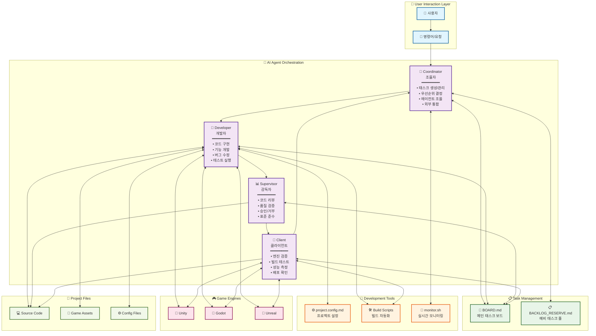
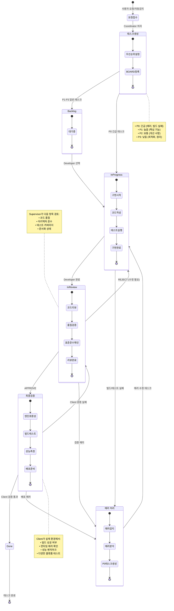
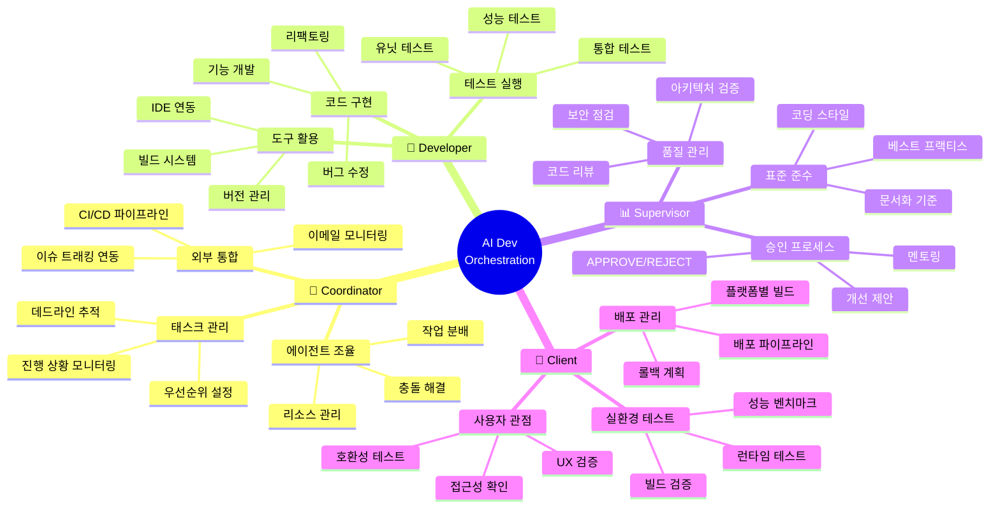
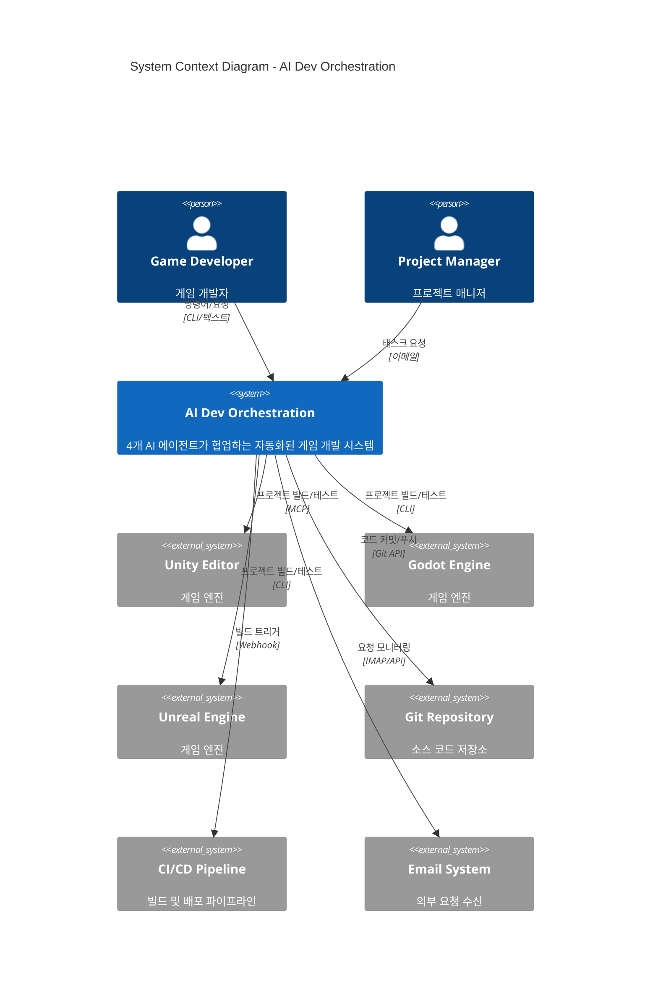

# README 배너 및 아키텍처 다이어그램

## 개요
README.md용 프로젝트 배너 이미지, 4-에이전트 아키텍처 다이어그램, 태스크 생명주기 플로우차트

## 1. 프로젝트 배너

### ASCII 아트 배너
```
 █████╗ ██╗    ██████╗ ███████╗██╗   ██╗
██╔══██╗██║    ██╔══██╗██╔════╝██║   ██║
███████║██║    ██║  ██║█████╗  ██║   ██║
██╔══██║██║    ██║  ██║██╔══╝  ╚██╗ ██╔╝
██║  ██║██║    ██████╔╝███████╗ ╚████╔╝
╚═╝  ╚═╝╚═╝    ╚═════╝ ╚══════╝  ╚═══╝

   🤖 Autonomous Intelligence Development Orchestration
   ────────────────────────────────────────────────────
   4개 전문 에이전트가 협업하는 자동화된 게임 개발 시스템
```

### 컴팩트 배너 (Markdown)
```markdown
# 🎮 AI-Dev Orchestration

> **자율 지능형 게임 개발 오케스트레이션 시스템**
> 4개 전문 AI 에이전트(Coordinator, Developer, Supervisor, Client)가
> 협업하여 게임 개발을 자동화하는 혁신적인 개발 환경

[](CHANGELOG.md)
[](LICENSE)
[](#architecture)
[](#supported-engines)
```

## 2. 4-에이전트 아키텍처 다이어그램



## 3. 태스크 생명주기 플로우차트



## 4. 에이전트 역할 상세도



## 5. 시스템 구성도



## 6. 배너 사용 가이드

### README.md 상단 배치
```markdown
<!-- 프로젝트 상단에 배치 -->
<div align="center">

# 🎮 AI-Dev Orchestration

> **자율 지능형 게임 개발 오케스트레이션 시스템**
> 4개 전문 AI 에이전트가 협업하여 게임 개발을 자동화하는 혁신적인 개발 환경

[](CHANGELOG.md)
[](LICENSE)
[](#architecture)

</div>

---

<!-- 아키텍처 다이어그램은 별도 섹션에 배치 -->
## 🏗️ 아키텍처

[아키텍처 다이어그램 삽입]

## 🔄 태스크 플로우

[태스크 생명주기 다이어그램 삽입]
```

### 다이어그램 파일 생성 스크립트
```bash
# Mermaid 다이어그램을 이미지로 변환
npx @mermaid-js/mermaid-cli -i architecture.mmd -o architecture.png -t dark -b transparent
npx @mermaid-js/mermaid-cli -i task-lifecycle.mmd -o task-lifecycle.png -t dark -b transparent
```

---

*생성일: 2026-04-16*
*태스크: A-003 프로젝트 README 배너 및 아키텍처 다이어그램*