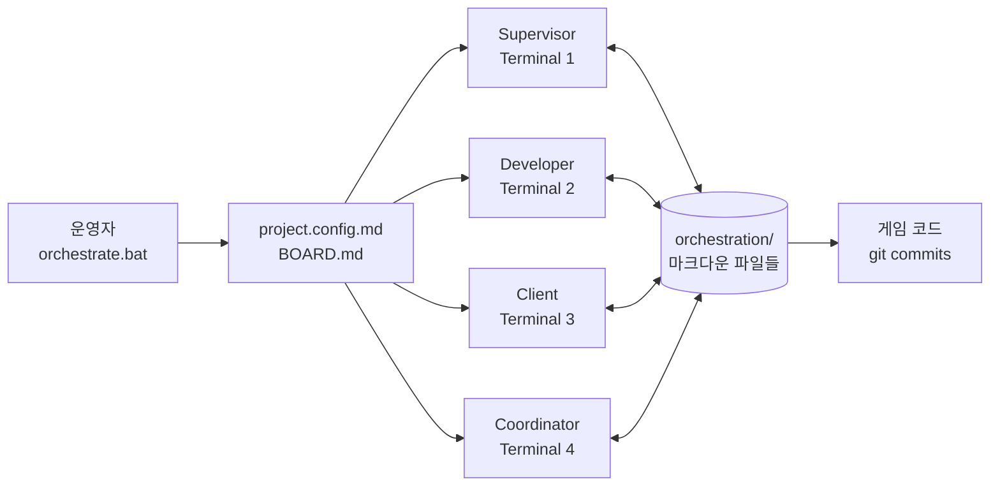

# 포트폴리오 소스 자료 작성 플랜

> **For agentic workers:** REQUIRED SUB-SKILL: Use superpowers:subagent-driven-development (recommended) or superpowers:executing-plans to implement this plan task-by-task. Steps use checkbox (`- [ ]`) syntax for tracking.

**Goal:** `Orchestration_general` 프레임워크와 `Gen` 검증 결과물에 대해, 사용자의 이력서·기존 PDF 포트폴리오에 발췌해 쓸 수 있는 단일 소스(case study source-of-truth) 마크다운 파일 1개를 작성한다.

**Architecture:** 4박자(진행→이슈→해결→결과) 이중 레이어 내러티브. Layer 1은 문서 전체의 4 Act 구조, Layer 2는 Act 3 안의 6개 결정 항목 각각의 미니 4박자. 본문 외에 발췌용 부록 6개(헤드라인/지표/이력서 bullet/코드 큐레이션/링크/캡처 슬롯).

**Tech Stack:** GitHub Flavored Markdown + Mermaid 다이어그램. 한국어 본문, 코드/파일명/커밋 해시는 원어. 두 레포(`Orchestration_general`, `Gen`)는 모두 GitHub public이므로 코드는 발췌하지 않고 링크 + 캡션 큐레이션 방식.

**Spec 참조:** `docs/superpowers/specs/2026-04-07-portfolio-source-material-design.md`

**산출물 경로:** `C:/sourcetree/Orchestration_general/docs/superpowers/specs/2026-04-07-orchestration-portfolio-source.md`

---

## Task 1: 데이터 수집 및 검증

이후 모든 Task가 이 데이터를 인용하므로, 반드시 가장 먼저 수행한다. 결과는 사용자에게 보고할 단일 데이터 블록(이 플랜 파일 하단의 "Working Data Block" 섹션에 누적 기록)에 모은다.

**Files:**
- Read: `C:/sourcetree/Orchestration_general/README.md`
- Read: `C:/sourcetree/Orchestration_general/framework/prompts/COORDINATOR.txt`
- Read: `C:/sourcetree/Orchestration_general/framework/prompts/DEVELOPER.txt`
- Read: `C:/sourcetree/Orchestration_general/framework/prompts/SUPERVISOR.txt` (있다면)
- Read: `C:/sourcetree/Orchestration_general/framework/prompts/CLIENT.txt` (있다면)
- Read: `C:/sourcetree/Gen/PROJECT_BRIEF.md`
- Read: `C:/sourcetree/Gen/orchestration/BOARD.md` (현재 보드 상태 캡처용)
- Bash: git 명령어들로 검증

- [ ] **Step 1.1: Orchestration_general 커밋 수와 기간 확인**

Run: `git -C C:/sourcetree/Orchestration_general log --oneline | wc -l`
Expected: 정수 (예: 16)

Run: `git -C C:/sourcetree/Orchestration_general log --format="%ai" | tail -1`
Run: `git -C C:/sourcetree/Orchestration_general log --format="%ai" | head -1`

검증된 값을 Working Data Block에 다음 형식으로 기록:
```
ORCH_TOTAL_COMMITS = <숫자>
ORCH_FIRST_COMMIT  = <YYYY-MM-DD>
ORCH_LAST_COMMIT   = <YYYY-MM-DD>
ORCH_DURATION_DAYS = <숫자>
```

- [ ] **Step 1.2: Gen 커밋 수와 기간 확인**

Run: `git -C C:/sourcetree/Gen log --oneline | wc -l`
Run: `git -C C:/sourcetree/Gen log --format="%ai" | tail -1`
Run: `git -C C:/sourcetree/Gen log --format="%ai" | head -1`

기록:
```
GEN_TOTAL_COMMITS  = <숫자>
GEN_FIRST_COMMIT   = <YYYY-MM-DD>
GEN_LAST_COMMIT    = <YYYY-MM-DD>
GEN_DURATION_DAYS  = <숫자>
```

- [ ] **Step 1.3: Gen 최근 커밋 메시지 10개 수집**

Run: `git -C C:/sourcetree/Gen log --oneline -10`

10개를 그대로 Working Data Block에 옮긴다. Act 4와 부록 B에서 인용함. **이 중 5~6개**를 최종 본문 인용에 쓴다 (가장 의미 있는 fix/feature 메시지 우선).

- [ ] **Step 1.4: Orchestration_general의 핵심 이슈 커밋 해시 검증**

스펙 §4 Act 2에서 언급한 커밋 해시들이 실제로 존재하고 메시지가 맞는지 확인.

Run: `git -C C:/sourcetree/Orchestration_general show aad2d65 --stat -s`
Run: `git -C C:/sourcetree/Orchestration_general show 2b253b6 --stat -s`
Run: `git -C C:/sourcetree/Orchestration_general show 652d5f7 --stat -s`
Run: `git -C C:/sourcetree/Orchestration_general show 1cedb0d --stat -s` (Entry Hub)
Run: `git -C C:/sourcetree/Orchestration_general show 8602cef --stat -s` (Preflight templates)
Run: `git -C C:/sourcetree/Orchestration_general show d023986 --stat -s` (Operations + test controls)

각 해시의 실제 커밋 메시지를 Working Data Block에 옮긴다. 만약 해시가 존재하지 않거나 의미가 다르면 `git log --grep` 으로 대체 해시를 찾는다.

- [ ] **Step 1.5: Gen의 최고 태스크 번호(S-XXX) 확인**

Run: `git -C C:/sourcetree/Gen log --oneline | grep -oE "S-[0-9]+" | sort -V | tail -5`

가장 높은 번호를 확인. 스펙은 "S-001~S-113+"로 적었지만 실제 값으로 갱신.
기록: `GEN_HIGHEST_TASK = S-<숫자>`

- [ ] **Step 1.6: Gen의 시스템 파일 존재 확인**

Run: `find C:/sourcetree/Gen/Assets -type f -name "*.cs" | grep -iE "(GameManager|CombatManager|SkillSystem|InventorySystem|QuestSystem|SaveSystem)" 2>/dev/null | head -20`

존재하는 파일 경로를 모두 Working Data Block에 기록. 실제로 존재하지 않는 시스템은 본문에서 빼고, 존재하는 것만 인용한다.

- [ ] **Step 1.7: 4 에이전트 프롬프트 파일 읽기**

Read: `framework/prompts/COORDINATOR.txt`, `framework/prompts/DEVELOPER.txt`, 그 외 framework/prompts/ 디렉터리의 모든 .txt 파일

각 프롬프트의 첫 30~40줄을 훑어서 **각 에이전트의 핵심 책임을 한 줄로 요약**해 Working Data Block에 기록. 부록 D 코드 큐레이션의 캡션 작성용.

- [ ] **Step 1.8: 9개 언어 README 검증**

Run: `ls C:/sourcetree/Orchestration_general/README*.md`

번역된 언어 수와 파일 목록 기록. 스펙은 "9개 언어"로 적었으나 실제 값으로 갱신.

- [ ] **Step 1.9: GitHub 원격 URL 확인**

Run: `git -C C:/sourcetree/Orchestration_general remote get-url origin`
Run: `git -C C:/sourcetree/Gen remote get-url origin`

부록 E 링크 모음에 사용할 URL을 기록. SSH URL인 경우 HTTPS로 변환해서 보관 (예: `git@github.com:user/repo.git` → `https://github.com/user/repo`).

- [ ] **Step 1.10: 산출물 파일이 아직 없는지 확인**

Run: `ls C:/sourcetree/Orchestration_general/docs/superpowers/specs/2026-04-07-orchestration-portfolio-source.md 2>&1`
Expected: "No such file or directory"

만약 이미 존재한다면 사용자에게 확인 후 진행 (덮어쓰기 위험).

---

## Task 2: 산출물 파일 스켈레톤 생성

Task 1의 데이터가 모두 모인 후 진행. 빈 섹션 헤딩으로 전체 골격만 먼저 만들고, 이후 Task에서 채운다.

**Files:**
- Create: `docs/superpowers/specs/2026-04-07-orchestration-portfolio-source.md`

- [ ] **Step 2.1: 파일 생성 + 메타블록 + 전체 섹션 헤딩**

Write 다음 골격(Working Data Block의 검증된 값을 메타블록에 채워 넣는다):

```markdown
# Orchestration_general — 케이스 스터디 소스 자료

> 이 문서는 이력서·포트폴리오 양쪽에서 발췌해 쓰는 단일 소스다.
> 본문(Act 1~4)은 4박자 스토리, 부록(A~F)은 발췌용 토막이다.
> 스펙: `docs/superpowers/specs/2026-04-07-portfolio-source-material-design.md`

---

## 메타

| 항목 | 내용 |
|------|------|
| 프로젝트명 | Orchestration_general (Claude Orchestration Framework) |
| 한 줄 정의 | Claude CLI 4-에이전트 멀티 에이전트 오케스트레이션 프레임워크 |
| 개발 기간 | <ORCH_FIRST_COMMIT> ~ <ORCH_LAST_COMMIT> (<ORCH_DURATION_DAYS>일) |
| 검증 결과물 | GenWorld (Unity 2D RPG) — <GEN_DURATION_DAYS>일 / <GEN_TOTAL_COMMITS> 커밋 |
| 역할 | 단독 설계·구현·운영 |
| 사용 기술 | Claude CLI, Bash, Batch, PowerShell, Markdown, Mermaid, Git, Unity 2D / C# |
| GitHub | <ORCH_REPO_URL> · <GEN_REPO_URL> |

---

# Act 1. 진행한 방향

<!-- Task 3에서 채움 -->

# Act 2. 이슈 발생

<!-- Task 4에서 채움 -->

# Act 3. 해결 방향

## 3-1. FREEZE / DRAIN_FOR_TEST 제어 플래그

<!-- Task 5에서 채움 -->

## 3-2. Preflight 단계 + 템플릿 스캐폴드

<!-- Task 5에서 채움 -->

## 3-3. 6단계 라이프사이클 모델

<!-- Task 5에서 채움 -->

## 3-4. 단일 Entry Hub `orchestration-tools.bat`

<!-- Task 6에서 채움 -->

## 3-5. Windows 런타임 안정화 패치 묶음

<!-- Task 6에서 채움 -->

## 3-6. 9개 언어 README 확산 전략

<!-- Task 6에서 채움 -->

# Act 4. 결과 — GenWorld 검증

<!-- Task 7에서 채움 -->

---

# 부록

## 부록 A. 헤드라인 카피 3종

<!-- Task 8에서 채움 -->

## 부록 B. 핵심 지표 Quant Block

<!-- Task 8에서 채움 -->

## 부록 C. 이력서 발췌 bullet

<!-- Task 8에서 채움 -->

## 부록 D. 코드 큐레이션

<!-- Task 9에서 채움 -->

## 부록 E. 링크 모음

<!-- Task 9에서 채움 -->

## 부록 F. 캡처 슬롯 일람

<!-- Task 9에서 채움 -->
```

- [ ] **Step 2.2: 파일이 생성되었는지 확인**

Read 파일을 다시 읽어 메타블록에 placeholder가 모두 실제 값으로 채워졌는지 확인. `<ORCH_*>` 등 산모양 괄호가 본문에 남아 있으면 안 된다.

- [ ] **Step 2.3: 1차 커밋**

```bash
cd C:/sourcetree/Orchestration_general
git add docs/superpowers/specs/2026-04-07-orchestration-portfolio-source.md
git commit -m "docs: scaffold portfolio source material structure

Co-Authored-By: Claude Opus 4.6 (1M context) <noreply@anthropic.com>"
```

---

## Task 3: Act 1 (진행한 방향) 작성

**Files:**
- Modify: `docs/superpowers/specs/2026-04-07-orchestration-portfolio-source.md` (Act 1 섹션)

- [ ] **Step 3.1: 출발 동기 단락**

Act 1 첫 단락으로, 다음 3가지 요소를 한국어 3~4문장 안에 담는다.
1. 출발 가설: "Claude CLI를 단일 세션이 아니라 여러 역할로 분리해서 자율 협업시키면, 사람이 매번 지시하지 않아도 게임 같은 복잡한 프로젝트를 끝까지 끌고 갈 수 있을까?"
2. 초기 접근의 한계: 단일 세션은 컨텍스트가 빠르게 오염되고, 한 에이전트에게 구현·리뷰·관리를 모두 맡기면 어느 한 역할이 흐려진다.
3. 결정: 역할별로 4개의 에이전트(Supervisor / Developer / Client / Coordinator)로 분리하고, 인메모리 큐나 API 콜이 아니라 **파일 기반 비동기 메시징**을 단일 진실로 삼는다.

이 단락은 부록 A의 1문단 헤드라인의 베이스가 된다.

- [ ] **Step 3.2: 4 에이전트의 역할 표**

다음과 같은 마크다운 표를 작성. 각 행의 "한 줄 책임"은 Working Data Block의 Step 1.7에서 추출한 프롬프트 요약을 사용한다.

```markdown
| Agent | 역할 | 한 줄 책임 |
|-------|------|-----------|
| Supervisor | Orchestrator | <Step 1.7에서 추출> |
| Developer | Builder | <Step 1.7에서 추출> |
| Client | Reviewer | <Step 1.7에서 추출> |
| Coordinator | Manager | <Step 1.7에서 추출> |
```

- [ ] **Step 3.3: 첫 모양 설명 (orchestration/ 디렉터리 구조)**

3~5줄로:
- 모든 상태가 `orchestration/` 디렉터리 안의 마크다운 파일에 기록된다.
- 핵심 파일은 `BOARD.md` (Backlog → In Progress → In Review → Done 칸반), `BACKLOG_RESERVE.md`, `tasks/`, `reviews/`, `specs/`, `discussions/`, `logs/`.
- 모든 에이전트는 매 루프 시작 시 `BOARD.md`를 읽고, 자기 차례에 맞는 행동을 취한 뒤, 결과를 다시 마크다운에 적는다.
- 사람과 에이전트가 같은 포맷을 읽고 쓸 수 있으니 운영자가 언제든 끼어들 수 있다.

- [ ] **Step 3.4: Mermaid 아키텍처 다이어그램 추가**

다음 Mermaid 코드를 Act 1 끝부분에 박는다. 사용자가 GitHub에서 렌더링한 결과를 캡처해서 PDF에 박을 수 있다.

````markdown

````

- [ ] **Step 3.5: 캡처 슬롯 추가**

Act 1 끝에:
```
[SCREENSHOT: 4개 터미널이 동시에 돌아가는 화면 — Windows Terminal 분할 또는 4개 창]
[SCREENSHOT: orchestration/ 디렉터리 트리 (예: VS Code 또는 Tree 명령어)]
```

- [ ] **Step 3.6: 커밋**

```bash
cd C:/sourcetree/Orchestration_general
git add docs/superpowers/specs/2026-04-07-orchestration-portfolio-source.md
git commit -m "docs: write Act 1 (진행한 방향) of portfolio source

Co-Authored-By: Claude Opus 4.6 (1M context) <noreply@anthropic.com>"
```

---

## Task 4: Act 2 (이슈 발생) 작성

**Files:**
- Modify: `docs/superpowers/specs/2026-04-07-orchestration-portfolio-source.md` (Act 2 섹션)

- [ ] **Step 4.1: 도입 단락**

2~3문장으로: "프레임워크의 첫 모양은 GenWorld 포팅을 5일간 돌리면서 진짜 문제들을 만났다. 가장 큰 깨달음은 '에이전트가 자율적으로 돈다'와 '운영 가능하다'는 다른 문제라는 것이었다." 같은 톤.

- [ ] **Step 4.2: 6개 이슈 리스트 작성**

각 이슈는 다음 형식으로:

```markdown
### 이슈 #N. <한 줄 제목>

- **증상:** <어떤 현상이 나타났는가, 1~2줄>
- **맥락:** <언제·어디서 만났는가, 1줄>
- **단서:** <관련 커밋 해시 또는 파일 — Step 1.4에서 검증된 값만>
```

6개 이슈:
1. **라이브 시스템을 안전하게 멈출 방법이 없음**
   - 증상: 작업 중간에 4개 터미널을 Ctrl+C로 죽이면 BOARD 상태와 git working tree가 어긋남. 수동 테스트 윈도우를 확보하기 위해 안전 정지가 필요했지만 프로토콜이 없었음.
   - 맥락: GenWorld에서 인게임 빌드를 직접 돌려보고 싶을 때마다 발생.
   - 단서: 이 이슈는 단일 커밋이 아니라 운영 패턴에서 드러남. 해결안 3-1의 도입 시점이 단서.

2. **Windows에서 러너 스크립트가 CWD 문제로 깨짐**
   - 증상: `.run_*.sh` 러너가 잘못된 작업 디렉터리에서 실행되어 파일을 못 찾음.
   - 맥락: 프로젝트 루트가 아닌 곳에서 orchestrate.bat을 실행할 때.
   - 단서: 커밋 `aad2d65` (Step 1.4 검증값으로 교체)

3. **Resume 모드 파싱이 stdout에 잡음을 흘림**
   - 증상: `Reconfigure` / `Resume` 분기 출력에 비ASCII 잡음이 섞여 자동화 파싱이 실패.
   - 맥락: 기존 orchestration이 있는 프로젝트에서 재시작할 때.
   - 단서: 커밋 `2b253b6`

4. **Loop runner가 조용히 죽음**
   - 증상: 루프가 한 번 돌고 나서 다음 이터레이션으로 진입하지 못함. 에러도 없이 멈춤.
   - 맥락: 장시간 운영 중 무작위로 발생.
   - 단서: 커밋 `652d5f7`

5. **도큐먼트가 부족한 프로젝트에 에이전트를 붙이면 잘못된 결정**
   - 증상: README/현재 상태/우선순위 문서가 없는 프로젝트에서 에이전트가 임의로 가정하고 작업.
   - 맥락: 신규 프로젝트 도입 시도.
   - 단서: 커밋 `8602cef` (Preflight 템플릿 추가)

6. **운영자가 매번 어떤 .bat을 실행해야 할지 헷갈림**
   - 증상: orchestrate.bat / monitor.bat / manage-orchestration.bat / test-orchestration.bat 등 7개 .bat의 역할이 운영자에게 직관적이지 않음.
   - 맥락: 일상 운영 중 빈번.
   - 단서: 커밋 `1cedb0d` (Entry Hub 도입)

- [ ] **Step 4.3: 마무리 단락**

1~2줄: "이 6개 이슈가 모여서 '자율 동작 자체'가 아니라 '운영 가능성·재현성·안전 정지' 라는 다음 문제를 정의했다."

- [ ] **Step 4.4: 커밋**

```bash
cd C:/sourcetree/Orchestration_general
git add docs/superpowers/specs/2026-04-07-orchestration-portfolio-source.md
git commit -m "docs: write Act 2 (이슈 발생) with verified commit hashes

Co-Authored-By: Claude Opus 4.6 (1M context) <noreply@anthropic.com>"
```

---

## Task 5: Act 3 결정 항목 3-1 ~ 3-3 작성

각 항목은 **미니 4박자** 형식으로 작성한다. 4박자는 다음 4개 라벨을 그대로 사용한다.

**Files:**
- Modify: `docs/superpowers/specs/2026-04-07-orchestration-portfolio-source.md` (Act 3 섹션의 3-1, 3-2, 3-3)

미니 4박자 템플릿 (모든 항목이 이 형식을 정확히 따른다):

```markdown
## 3-N. <항목 제목>

- **진행한 방향:** <초기 접근, 1~2줄>
- **이슈 발생:** <부딪힌 문제, 1~2줄. 가능하면 Act 2의 이슈 번호를 인용>
- **해결 방향:** <결정 + 대안 비교 + 이유, 2~4줄. "vs X" 형식으로 대안 명시>
- **결과:** <측정 가능한 변화, 1~2줄>
```

- [ ] **Step 5.1: 3-1 FREEZE / DRAIN_FOR_TEST 제어 플래그**

```markdown
## 3-1. FREEZE / DRAIN_FOR_TEST 제어 플래그

- **진행한 방향:** 처음에는 4개 터미널을 직접 Ctrl+C로 죽이는 방식이었음. 작동은 하지만 운영 가능한 시스템이라 부를 수 없었음.
- **이슈 발생:** 이슈 #1. 작업 중간 강제 정지 시 BOARD 상태와 git working tree가 어긋나고, 수동 테스트 윈도우를 확보할 방법이 없었음.
- **해결 방향:** BOARD.md 상단에 두 종류의 협력적 정지 플래그를 두기로 결정.
  `FREEZE`는 즉시 정지(다음 루프 진입 차단), `DRAIN_FOR_TEST`는 현재 태스크를 안전 체크포인트까지 소화한 뒤 정지. 모든 에이전트가 매 루프 첫 줄에서 이를 읽도록 프로토콜화.
  대안 비교 — (a) OS 시그널: 멱등성/리커버리 없음. (b) 락 파일 단일 종류: 안전 체크포인트와 즉시 정지의 의미 차이를 표현 못함. (c) 두 단계 협력적 플래그(채택): 사람·에이전트 양쪽이 같은 마크다운으로 의도를 표현 가능.
- **결과:** `manage-orchestration.bat` 한 번으로 라이브 시스템을 안전하게 멈춤·재개. GenWorld 운영 중 수동 인게임 테스트 윈도우 확보 가능해짐.
```

- [ ] **Step 5.2: 3-2 Preflight 단계 + 템플릿 스캐폴드**

```markdown
## 3-2. Preflight 단계 + 템플릿 스캐폴드

- **진행한 방향:** 신규 프로젝트에 프레임워크를 붙일 때, 에이전트가 알아서 코드를 읽고 컨텍스트를 만들 거라 가정했음.
- **이슈 발생:** 이슈 #5. 도큐먼트 빈약한 프로젝트에서 에이전트는 추측으로 의사결정했고, 잘못된 가정 위에 코드를 쌓았음.
- **해결 방향:** 프레임워크 본 실행 앞에 **Preflight 단계**를 추가하고, `docs/templates/` 안에 4종 템플릿(current-state / dev-priorities / testing / architecture)을 미리 두어 자동 스캐폴드. 기존 파일은 절대 덮어쓰지 않음.
  대안 비교 — (a) "에이전트가 알아서 만들도록 프롬프트": 매번 다른 결과, 재현성 없음. (b) "사용자가 수동으로 채우도록 안내": 진입 장벽 ↑, 도입 실패율 ↑. (c) 자동 스캐폴드 + 운영자 검토(채택): 비어 있어도 빈 칸의 위치가 명시되어 운영자 판단이 들어갈 자리를 만든다.
- **결과:** 신규 프로젝트 도입 시 첫 루프부터 에이전트가 일관된 컨텍스트를 가지고 시작. PRE-FLIGHT-CHECKLIST.md가 도입 가이드 역할.
```

- [ ] **Step 5.3: 3-3 6단계 라이프사이클 모델**

```markdown
## 3-3. 6단계 라이프사이클 모델 (Preflight → Bootstrap → Seed → Operate → Control → Test)

- **진행한 방향:** 초기 모델은 "한 번 셋업하면 끝"이었음. 운영자가 무엇을 언제 해야 하는지 가이드 없음.
- **이슈 발생:** 이슈 #6의 일부. 일상 운영에서 어떤 행동이 어떤 단계에 속하는지 운영자에게 직관적이지 않았음.
- **해결 방향:** 프레임워크를 6단계 라이프사이클로 재정의 — Preflight(컨텍스트 정비) → Bootstrap(orchestrate 실행) → Seed(백로그 채우기) → Operate(자동 진행) → Control(FREEZE/DRAIN으로 조향) → Test(수동 검증). 각 단계가 어떤 도구를 쓰는지 README에 표로 정리.
  대안 비교 — (a) 단계 없는 자유 운영: 진입 장벽 ↑. (b) 더 많은 단계(8~10): 인지 부담 ↑. (c) 6단계(채택): "한 페이지 표"로 외우기에 적당한 인지 단위.
- **결과:** README와 entry hub가 모두 라이프사이클 어휘로 통일. 운영자가 "지금 나는 어느 단계에 있나"를 항상 알 수 있음.
```

- [ ] **Step 5.4: 커밋**

```bash
cd C:/sourcetree/Orchestration_general
git add docs/superpowers/specs/2026-04-07-orchestration-portfolio-source.md
git commit -m "docs: write Act 3 decisions 3-1 through 3-3

Co-Authored-By: Claude Opus 4.6 (1M context) <noreply@anthropic.com>"
```

---

## Task 6: Act 3 결정 항목 3-4 ~ 3-6 작성

**Files:**
- Modify: `docs/superpowers/specs/2026-04-07-orchestration-portfolio-source.md` (Act 3 섹션의 3-4, 3-5, 3-6)

- [ ] **Step 6.1: 3-4 단일 Entry Hub `orchestration-tools.bat`**

```markdown
## 3-4. 단일 Entry Hub `orchestration-tools.bat`

- **진행한 방향:** 도구가 늘어나면서 7개 이상의 .bat 파일이 생김 — orchestrate, monitor, manage, test, monitor-orchestration 등.
- **이슈 발생:** 이슈 #6. 운영자(나 자신 포함)가 "지금 어떤 .bat을 실행해야 하지?"를 매번 헷갈림.
- **해결 방향:** 단일 진입점 `orchestration-tools.bat`을 만들고, 그 안에서 setup / monitor / control / test / runtime 모니터 / feature 추가 등 모든 일상 행동을 메뉴 형태로 제공. 개별 .bat은 "정확히 그 동작만 필요할 때"의 우회로로 남김.
  대안 비교 — (a) .bat 파일을 더 잘게 쪼개기: 인지 부담만 증가. (b) 자연어 CLI: 구현 비용 + Windows 환경 이슈. (c) 메뉴 기반 hub(채택): 학습 비용 거의 0, 운영자가 다음 행동을 메뉴에서 발견 가능.
- **결과:** 신규 운영자가 `orchestration-tools.bat` 하나만 알면 일상 운영의 90%를 처리. README에서 "Recommended Entry Point"로 명시.
```

- [ ] **Step 6.2: 3-5 Windows 런타임 안정화 패치 묶음**

```markdown
## 3-5. Windows 런타임 안정화 패치 묶음

- **진행한 방향:** 초기 러너 스크립트는 macOS/Linux 가정으로 짜여 있었고, Windows에서도 그냥 돌아갈 거라 기대했음.
- **이슈 발생:** 이슈 #2/#3/#4가 모두 Windows 환경 차이에서 발생 — CWD 처리, 비ASCII 출력, 조용히 죽는 루프 등.
- **해결 방향:** 한 묶음의 안정화 패치로 동시 대응. (a) 러너 스크립트가 항상 자기 디렉터리 기준으로 동작하도록 CWD 명시 (`aad2d65`). (b) Resume 분기에서 stdout에 ASCII만 흐르도록 파싱 정리 (`2b253b6`). (c) Loop runner가 `Loop interval` 키를 안전하게 재파싱하고 fallback 처리 (`652d5f7`). (d) `project.config.md`에 ASCII-safe 키 네임 도입.
  대안 비교 — (a) Bash on WSL 강제: 운영자 진입 장벽 ↑. (b) 환경별 별도 러너: 유지보수 2배. (c) 안정화 패치(채택): 한 코드베이스로 양쪽 환경 지원.
- **결과:** Windows에서 동일한 러너 스크립트로 끊김 없는 장시간 운영 가능. README의 ASCII-safe 키 예시는 운영자에게 안정성 신호로 작동.
```

- [ ] **Step 6.3: 3-6 9개 언어 README 확산 전략**

Working Data Block의 Step 1.8 결과로 "9개"를 실제 값으로 갱신.

```markdown
## 3-6. <N>개 언어 README 확산 전략

- **진행한 방향:** README는 영어 한 벌만 있었음. 오픈소스 확산보다는 자기 작업 기록 용도였음.
- **이슈 발생:** 이슈 대응이 아닌 능동적 결정. "이 프레임워크가 한국어/일본어/중국어 사용자에게 닿을 수 있다면, 그 자체가 멀티 에이전트 협업의 또 다른 검증이 된다"는 가설.
- **해결 방향:** 프레임워크 자체로 다국어 README를 생성. Coordinator 에이전트가 README.md → README.<lang>.md 번역을 태스크로 받아 처리. 한국어를 시작으로 일본어·중국어·스페인어·독일어·프랑스어·힌디어·태국어·베트남어까지 확장.
  대안 비교 — (a) 영어만 유지: 확산 0. (b) 사람이 직접 번역: 유지보수 폭발. (c) 프레임워크 자체로 번역(채택): 프레임워크의 dogfooding이자 메타 검증.
- **결과:** README 진입점이 9개 언어로 분기. 한국어 사용자가 첫 클릭부터 모국어로 읽을 수 있음. 프레임워크의 "메타 결과물"로 포트폴리오 자체에서 어필 가능.
```

- [ ] **Step 6.4: 커밋**

```bash
cd C:/sourcetree/Orchestration_general
git add docs/superpowers/specs/2026-04-07-orchestration-portfolio-source.md
git commit -m "docs: write Act 3 decisions 3-4 through 3-6

Co-Authored-By: Claude Opus 4.6 (1M context) <noreply@anthropic.com>"
```

---

## Task 7: Act 4 (결과 — GenWorld 검증) 작성

**Files:**
- Modify: `docs/superpowers/specs/2026-04-07-orchestration-portfolio-source.md` (Act 4 섹션)

- [ ] **Step 7.1: 도입 단락 + 핵심 지표 표**

다음 마크다운을 작성. 모든 숫자는 Working Data Block의 Step 1.2 / 1.5 검증값으로 채움.

```markdown
프레임워크의 진짜 검증은 그 프레임워크로 만든 결과물이다. `Orchestration_general`은 별도 프로젝트인 GenWorld(Unity 2D RPG)를 개발하면서 동시에 진화했다.

| 지표 | 값 |
|------|-----|
| 게임 | GenWorld — Phaser 3 TypeScript RPG의 Unity 2D C# 포팅 |
| 기간 | <GEN_FIRST_COMMIT> ~ <GEN_LAST_COMMIT> (<GEN_DURATION_DAYS>일) |
| 총 커밋 | <GEN_TOTAL_COMMITS> |
| 보드 태스크 | S-001 ~ <GEN_HIGHEST_TASK> |
| 운영 모드 | full (4 에이전트) |
| 엔진 | Unity 2D / URP / C# |
```

- [ ] **Step 7.2: 시스템 목록**

Step 1.6에서 검증된 실제 파일 목록 기반으로:

```markdown
**구현된 주요 시스템 (실제 파일 존재 검증됨):**

- GameManager — <역할 한 줄>
- CombatManager — <역할 한 줄>
- SkillSystem — <역할 한 줄>
- InventorySystem — <역할 한 줄>
- QuestSystem — <역할 한 줄>
- SaveSystem — <역할 한 줄>
- AI/NPC dialogue — <역할 한 줄>
```

존재하지 않는 시스템은 포함하지 않는다.

- [ ] **Step 7.3: 최근 커밋 인용 (검증 신뢰도 신호)**

Step 1.3에서 가져온 10개 중 5~6개를 골라 다음 형식으로:

```markdown
**최근 5~6개 커밋 (라이브 운영 신호):**

- `8a3156e` — fix: skill VFX pipeline + map collider alignment + area effect tick VFX
- `bf997ae` — fix: S-113 WorldEvent drop/gold multipliers never applied
- `ed5d554` — fix: S-112 items missing sell prices + ShopUI unsellable filter
- ...
```

이 인용은 "이 프로젝트가 실제로 살아있는 시스템이다"라는 가장 강력한 신호다.

- [ ] **Step 7.4: 프레임워크 자체의 재사용성 단락**

3~4줄로:
- 프레임워크는 GenWorld 전용이 아니라, Unity / Godot / Unreal 자동 감지 기능을 갖춘 범용 도구.
- `sample-config/`에 Unity 2D RPG, Godot platformer 두 종류 샘플 설정 포함.
- 다른 게임 엔진/프로젝트로의 이식 가능성이 설계 단계부터 의도됨.

- [ ] **Step 7.5: 배운 점 / 다음에 다르게 할 것 (3~4개)**

각 항목 1~2줄. 시니어 면접 단골 질문에 대비.

예시(작성 시 본인 경험에 맞게 조정):

```markdown
**배운 점 / 다음에 다르게 할 것:**

1. **에이전트는 자율보다 운영 가능성이 우선이다.** "혼자 잘 도는 것"보다 "사람이 언제든 끼어들 수 있는 것"이 더 어렵고 더 중요하다. FREEZE/DRAIN을 더 일찍 도입했어야 했다.

2. **마크다운은 LLM 협업의 좋은 단일 진실 매체다.** JSON/DB는 사람이 못 읽고, 자유 텍스트는 에이전트가 못 파싱한다. 마크다운(특히 표와 체크박스)은 양쪽 모두에게 1급 시민이다.

3. **Preflight 단계는 LLM 도입 전 모든 프로젝트에 필요하다.** "에이전트가 알아서 컨텍스트를 만들 것"이라는 가정이 가장 큰 운영 리스크였다.

4. **(추가) 다음에는 …** (사용자 본인의 회고 1줄 추가)
```

- [ ] **Step 7.6: 캡처 슬롯**

Act 4 끝에:
```
[SCREENSHOT: GenWorld 인게임 — 전투 또는 NPC 상호작용 1~2장]
[SCREENSHOT: orchestration/BOARD.md 운영 중 캡처 — 칸반 컬럼이 채워진 모습]
[SCREENSHOT: git log --oneline -20 출력 — 활발한 커밋 라인]
```

- [ ] **Step 7.7: 커밋**

```bash
cd C:/sourcetree/Orchestration_general
git add docs/superpowers/specs/2026-04-07-orchestration-portfolio-source.md
git commit -m "docs: write Act 4 (GenWorld validation) of portfolio source

Co-Authored-By: Claude Opus 4.6 (1M context) <noreply@anthropic.com>"
```

---

## Task 8: 부록 A, B, C 작성 (헤드라인 / 지표 / 이력서 bullet)

**Files:**
- Modify: `docs/superpowers/specs/2026-04-07-orchestration-portfolio-source.md` (부록 A, B, C)

- [ ] **Step 8.1: 부록 A — 헤드라인 카피 3종**

다음 형식으로 작성. 모든 숫자는 Working Data Block 값으로.

```markdown
## 부록 A. 헤드라인 카피 3종

**1줄용 (이력서 경력 한 줄, 30~50자):**

> Claude CLI 4-에이전트 오케스트레이션 프레임워크 설계·구현, Unity 2D RPG로 검증

**2~3줄용 (이력서 프로젝트 요약, 80~150자):**

> Claude CLI 기반 4-에이전트(Supervisor/Developer/Client/Coordinator) 멀티 에이전트 오케스트레이션 프레임워크를 단독 설계·구현. 파일 기반 비동기 메시징, FREEZE/DRAIN 안전 제어, 6단계 라이프사이클을 갖춘 운영 가능한 시스템. <GEN_DURATION_DAYS>일 / <GEN_TOTAL_COMMITS> 커밋의 Unity 2D RPG로 실증.

**1문단용 (포트폴리오 표지 또는 about, 200~300자):**

> Orchestration_general은 Claude CLI를 4개의 역할별 에이전트로 분리하고 마크다운 파일을 단일 진실로 삼아, 사람이 매번 지시하지 않아도 게임 같은 복잡한 프로젝트를 끝까지 끌고 가도록 만든 멀티 에이전트 오케스트레이션 프레임워크다. 자율 동작 자체보다 "운영 가능성·재현성·안전 정지"를 핵심 설계 가치로 두었으며, FREEZE/DRAIN 협력적 정지 플래그, Preflight 단계, 6단계 라이프사이클, 단일 Entry Hub 등의 결정을 거쳐 실제 운영 가능한 시스템으로 진화했다. 검증 결과물인 GenWorld(Unity 2D RPG)는 <GEN_DURATION_DAYS>일 동안 <GEN_TOTAL_COMMITS> 커밋 / <GEN_HIGHEST_TASK>까지의 보드 태스크가 자동 흐름으로 처리되며 살아있는 시스템임을 증명한다.
```

- [ ] **Step 8.2: 부록 B — 핵심 지표 Quant Block**

```markdown
## 부록 B. 핵심 지표 Quant Block

검증 가능한 정량 지표만 모은 발췌용 블록.

- **에이전트 수:** 4 (Supervisor / Developer / Client / Coordinator)
- **에이전트 운영 모드:** 3종 (full / lean / solo)
- **자동 감지 게임 엔진:** 3종 (Unity / Godot / Unreal)
- **다국어 README:** <N>개 언어
- **라이프사이클 단계:** 6 (Preflight → Bootstrap → Seed → Operate → Control → Test)
- **검증 게임 (GenWorld):**
  - 기간: <GEN_DURATION_DAYS>일
  - 총 커밋: <GEN_TOTAL_COMMITS>
  - 보드 태스크: S-001 ~ <GEN_HIGHEST_TASK>
  - 주요 시스템 수: 7+ (GameManager, CombatManager, SkillSystem, InventorySystem, QuestSystem, SaveSystem, AI/NPC)
- **프레임워크 자체 커밋:** <ORCH_TOTAL_COMMITS>
- **단독 작업:** 1인 (설계·구현·운영 전부)
```

- [ ] **Step 8.3: 부록 C — 이력서 발췌 bullet 7~10개**

길이별로 섞어서. "성과 동사 + 숫자 + 결과" 패턴.

```markdown
## 부록 C. 이력서 발췌 bullet

이력서에 그대로 붙일 수 있도록 길이별로 준비. 회사·지원 직무에 따라 골라 쓴다.

**짧은 형식 (15~30자):**

- Claude CLI 멀티 에이전트 오케스트레이션 프레임워크 단독 설계·구현
- 4-에이전트 파일 기반 비동기 협업 시스템 구축
- Unity 2D RPG <GEN_DURATION_DAYS>일·<GEN_TOTAL_COMMITS>커밋 자동 출고

**중간 형식 (30~60자):**

- Claude CLI 4-에이전트 오케스트레이션 프레임워크를 단독 설계·구현하여 Unity 2D RPG <GEN_DURATION_DAYS>일/<GEN_TOTAL_COMMITS>커밋으로 검증
- 마크다운 파일 기반 비동기 메시징과 BOARD.md 칸반으로 사람·에이전트가 같은 단일 진실을 공유하는 협업 프로토콜 설계
- FREEZE/DRAIN_FOR_TEST 협력적 정지 플래그를 도입해 라이브 멀티 에이전트 시스템의 안전 정지·수동 테스트 윈도우 확보
- Preflight 단계 + 4종 템플릿 자동 스캐폴드로 신규 프로젝트의 LLM 도입 진입 장벽 제거

**긴 형식 (60~100자):**

- Claude CLI를 역할별 4 에이전트(Supervisor/Developer/Client/Coordinator)로 분리하고 파일 기반 비동기 메시징으로 협업시키는 오케스트레이션 프레임워크를 단독 설계·구현, Unity 2D RPG GenWorld 5일/<GEN_TOTAL_COMMITS>커밋으로 실증
- Preflight → Bootstrap → Seed → Operate → Control → Test 6단계 라이프사이클 모델과 단일 Entry Hub를 도입해 멀티 에이전트 시스템의 자율 동작 + 운영 가능성을 동시에 달성
- Unity·Godot·Unreal 자동 감지, 9개 언어 README, ASCII-safe Windows 런타임 안정화 패치를 포함한 범용 게임 개발 오케스트레이션 도구로 발전시킴
```

- [ ] **Step 8.4: 커밋**

```bash
cd C:/sourcetree/Orchestration_general
git add docs/superpowers/specs/2026-04-07-orchestration-portfolio-source.md
git commit -m "docs: write appendices A-C (headlines, quant, resume bullets)

Co-Authored-By: Claude Opus 4.6 (1M context) <noreply@anthropic.com>"
```

---

## Task 9: 부록 D, E, F 작성 (코드 큐레이션 / 링크 / 캡처 슬롯)

**Files:**
- Modify: `docs/superpowers/specs/2026-04-07-orchestration-portfolio-source.md` (부록 D, E, F)

- [ ] **Step 9.1: 부록 D — 코드 큐레이션**

5~7개 핵심 파일에 한 줄 캡션 + GitHub 링크. Step 1.7과 1.9의 데이터를 사용.

```markdown
## 부록 D. 코드 큐레이션

이 프로젝트를 평가할 때 가장 먼저 봐주면 좋을 파일들. 면접 시 화면을 띄워놓고 설명하기 좋은 순서로 정리.

| 파일 | 한 줄 설명 |
|------|-----------|
| [`README.md`](<ORCH_REPO_URL>/blob/main/README.md) | 프레임워크 전체 그림 — 4 에이전트, 라이프사이클, 운영 모델이 한 페이지에 모여 있음 |
| [`framework/prompts/COORDINATOR.txt`](<ORCH_REPO_URL>/blob/main/framework/prompts/COORDINATOR.txt) | 매니저 역할 에이전트의 루프 프롬프트 — BOARD 동기화/충돌 결론/태스크 발행 |
| [`framework/prompts/DEVELOPER.txt`](<ORCH_REPO_URL>/blob/main/framework/prompts/DEVELOPER.txt) | 빌더 역할 에이전트의 루프 프롬프트 — 태스크 픽업/구현/리뷰 요청 |
| [`framework/prompts/SUPERVISOR.txt`](<ORCH_REPO_URL>/blob/main/framework/prompts/SUPERVISOR.txt) | 오케스트레이터 에이전트 — 에셋/품질 감사/보드 관리 |
| [`framework/prompts/CLIENT.txt`](<ORCH_REPO_URL>/blob/main/framework/prompts/CLIENT.txt) | 다중 페르소나 QA 리뷰어 — APPROVE/NEEDS_WORK 판정 |
| [`orchestrate.bat`](<ORCH_REPO_URL>/blob/main/orchestrate.bat) | 메인 진입점 — 의존성 체크 + 폴더 선택 + 엔진 감지 + 셋업 + 런치 |
| [`orchestration-tools.bat`](<ORCH_REPO_URL>/blob/main/orchestration-tools.bat) | 단일 운영자 hub — 일상 운영의 90%가 여기 메뉴 안에 있음 |
| [`auto-setup.sh`](<ORCH_REPO_URL>/blob/main/auto-setup.sh) | 인터랙티브 셋업 본체 — 엔진 감지 + 설정 생성 + 프롬프트 발행 |

**검증 결과물(Gen) 측 주요 파일:**

| 파일 | 한 줄 설명 |
|------|-----------|
| [`PROJECT_BRIEF.md`](<GEN_REPO_URL>/blob/main/PROJECT_BRIEF.md) | GenWorld 프로젝트 개요 — 무엇을 왜 어떻게 만들었나 |
| [`orchestration/BOARD.md`](<GEN_REPO_URL>/blob/main/orchestration/BOARD.md) | 라이브 보드 — 진행 중인 칸반 컬럼 |
```

- [ ] **Step 9.2: 부록 E — 링크 모음**

Step 1.9 데이터 사용.

```markdown
## 부록 E. 링크 모음

**GitHub 레포:**
- 프레임워크: <ORCH_REPO_URL>
- 검증 게임 GenWorld: <GEN_REPO_URL>

**핵심 한국어 자료:**
- [README.ko.md](<ORCH_REPO_URL>/blob/main/README.ko.md) — 한국어 README

**핵심 커밋 (Act 2/3 인용):**
- [`aad2d65`](<ORCH_REPO_URL>/commit/aad2d65) — 러너 스크립트 CWD 수정
- [`2b253b6`](<ORCH_REPO_URL>/commit/2b253b6) — Resume 모드 파싱 출력 정리
- [`652d5f7`](<ORCH_REPO_URL>/commit/652d5f7) — Loop 러너 + 설정 파싱 복구
- [`8602cef`](<ORCH_REPO_URL>/commit/8602cef) — Preflight 템플릿 + 라이프사이클 가이드
- [`d023986`](<ORCH_REPO_URL>/commit/d023986) — 운영 + 테스트 제어 도입
- [`1cedb0d`](<ORCH_REPO_URL>/commit/1cedb0d) — Entry Hub + Preflight 정리
```

- [ ] **Step 9.3: 부록 F — 캡처 슬롯 일람**

본문에 박힌 모든 [SCREENSHOT: ...] 슬롯을 한 자리에 모아서 사용자가 쉽게 캡처할 수 있도록.

```markdown
## 부록 F. 캡처 슬롯 일람

본인이 직접 캡처해서 넣을 자리. 본문 위치별로 정리.

| 위치 | 캡처 내용 | 권장 도구 |
|------|----------|----------|
| Act 1 끝 | 4개 터미널이 동시에 돌아가는 화면 | Windows Terminal 분할 또는 4창 띄우고 Snipping Tool |
| Act 1 끝 | `orchestration/` 디렉터리 트리 | VS Code 사이드바 또는 `tree` 명령 출력 |
| Act 4 끝 | GenWorld 인게임 (전투 또는 NPC 상호작용) 1~2장 | Unity Editor 게임 뷰 캡처 |
| Act 4 끝 | `orchestration/BOARD.md` 운영 중 캡처 | VS Code 마크다운 프리뷰 |
| Act 4 끝 | `git log --oneline -20` 출력 | 터미널 캡처 |

**선택 사항 (있으면 더 좋음):**
- Mermaid 다이어그램(Act 1)을 GitHub에서 렌더한 화면을 이미지로 내려받아 PDF에 박기
- README.ko.md GitHub 페이지 캡처 (다국어 진입점 강조용)
```

- [ ] **Step 9.4: 커밋**

```bash
cd C:/sourcetree/Orchestration_general
git add docs/superpowers/specs/2026-04-07-orchestration-portfolio-source.md
git commit -m "docs: write appendices D-F (code curation, links, screenshots)

Co-Authored-By: Claude Opus 4.6 (1M context) <noreply@anthropic.com>"
```

---

## Task 10: 최종 검증 + 사용자 검토 보고

**Files:**
- Read: `docs/superpowers/specs/2026-04-07-orchestration-portfolio-source.md` (전체)

- [ ] **Step 10.1: 전체 파일 읽기**

Read 산출물 전체. placeholder 텍스트(`<ORCH_*>`, `<GEN_*>`, `<N>`, `TBD`, `TODO`)가 본문에 남아 있으면 안 된다.

Run: `grep -n "<ORCH\|<GEN\|<N>\|TBD\|TODO" C:/sourcetree/Orchestration_general/docs/superpowers/specs/2026-04-07-orchestration-portfolio-source.md`
Expected: 매치 없음

매치가 있으면 해당 라인을 Working Data Block 값으로 즉시 교체하고 다시 검사.

- [ ] **Step 10.2: 모든 숫자 재검증**

본문에 등장한 모든 숫자(커밋 수, 일수, 태스크 번호, 언어 수)가 Working Data Block의 검증값과 일치하는지 grep으로 확인.

- [ ] **Step 10.3: 모든 커밋 해시 실재성 검증**

```bash
for hash in aad2d65 2b253b6 652d5f7 8602cef d023986 1cedb0d; do
  git -C C:/sourcetree/Orchestration_general show $hash --format="%h %s" -s 2>&1 | head -1
done
```
Expected: 6개 모두 실제 커밋이 출력되어야 함. "fatal" 또는 "unknown revision"이 나오면 그 해시는 본문에서 빼거나 대체 해시를 찾는다.

- [ ] **Step 10.4: 스펙 §7 검증 기준 수동 체크**

스펙 `2026-04-07-portfolio-source-material-design.md`의 §7 체크리스트 8개 항목을 하나하나 본문에서 확인:

1. [ ] 4 Act 본문이 모두 작성됨
2. [ ] Act 3의 6개 결정 항목이 각각 미니 4박자(진행한 방향/이슈 발생/해결 방향/결과)를 명시적 라벨로 갖춤
3. [ ] 부록 A~F가 모두 채워짐
4. [ ] 본문 숫자가 git log로 재검증됨
5. [ ] 본문 커밋 해시가 실재함
6. [ ] Mermaid 다이어그램이 1개 이상 포함됨
7. [ ] 부록 D·E의 GitHub 링크가 작동 형태 (실제 URL 형식)
8. [ ] 이력서 bullet이 7~10개 (실제 카운트 후 확인)

- [ ] **Step 10.5: 최종 커밋 (이미 단계별로 커밋했으므로 변경 없으면 스킵)**

```bash
cd C:/sourcetree/Orchestration_general
git status
```
Expected: working tree clean (모든 단계별 커밋이 끝났으므로)

만약 dirty면 마지막 변경을 커밋:
```bash
git add docs/superpowers/specs/2026-04-07-orchestration-portfolio-source.md
git commit -m "docs: final pass on portfolio source material

Co-Authored-By: Claude Opus 4.6 (1M context) <noreply@anthropic.com>"
```

- [ ] **Step 10.6: 사용자에게 검토 요청**

산출물 경로와 함께 다음을 요약 보고:
- 전체 분량 (라인 수)
- Act별 주요 인용 / 결정 / 결과 요약
- 부록별 주요 발췌 항목
- 사용자가 다음에 해야 할 일: (a) 캡처 5장 찍어 슬롯에 박기, (b) Mermaid 다이어그램 GitHub에서 렌더해 이미지로 변환, (c) 본문에서 마음에 드는 발췌만 골라 기존 PDF 포트폴리오·이력서에 옮기기

---

## Task 11: 네트워크 폴더로 사본 배포 + PC 종료

사용자가 자리를 비울 예정이므로 산출물을 정해진 네트워크 위치로 옮기고 PC를 종료한다.

**Files:**
- Read: `docs/superpowers/specs/2026-04-07-orchestration-portfolio-source.md`
- Read: `docs/superpowers/specs/2026-04-07-portfolio-source-material-design.md`
- Read: `docs/superpowers/plans/2026-04-07-portfolio-source-material.md`
- Copy to: `N:/homes/semirain/Documents/회사/새 폴더/`

- [ ] **Step 11.1: 대상 폴더 존재 확인 + 생성**

Run: `ls "N:/homes/semirain/Documents/회사/" 2>&1`
Expected: `새 폴더`가 보이거나, 없으면 다음 명령으로 생성

Run: `mkdir -p "N:/homes/semirain/Documents/회사/새 폴더"`

- [ ] **Step 11.2: 산출물(소스 자료) 복사**

Run:
```
cp "C:/sourcetree/Orchestration_general/docs/superpowers/specs/2026-04-07-orchestration-portfolio-source.md" "N:/homes/semirain/Documents/회사/새 폴더/"
```

- [ ] **Step 11.3: 디자인 명세 + 플랜도 함께 복사 (참조용)**

산출물만 가는 것보다, 디자인 명세와 작성 플랜도 같은 폴더에 두면 나중에 본인이 맥락을 다시 잡기 쉽다.

Run:
```
cp "C:/sourcetree/Orchestration_general/docs/superpowers/specs/2026-04-07-portfolio-source-material-design.md" "N:/homes/semirain/Documents/회사/새 폴더/"
cp "C:/sourcetree/Orchestration_general/docs/superpowers/plans/2026-04-07-portfolio-source-material.md" "N:/homes/semirain/Documents/회사/새 폴더/"
```

- [ ] **Step 11.4: 복사 결과 검증**

Run: `ls -la "N:/homes/semirain/Documents/회사/새 폴더/"`
Expected: 3개 파일 모두 존재 (source, design, plan)

- [ ] **Step 11.5: 사용자에게 종료 직전 최종 보고**

3~5줄로 요약:
- 산출물 위치 (로컬 + 네트워크)
- 다음에 본인이 해야 할 일 (캡처/렌더/발췌)
- 60초 후 PC 종료 예정 — 그 안에 인터럽트하면 종료 취소 가능

- [ ] **Step 11.6: PC 종료**

Run: `shutdown /s /t 60 /c "Claude Code: 포트폴리오 자료 작업 완료. 60초 후 종료."`

`/t 60` — 60초 지연(사용자가 `shutdown /a`로 취소할 수 있는 시간 확보)
`/c "..."` — 종료 사유 메시지

종료 명령을 발행한 뒤 사용자에게 "취소하려면 cmd에서 `shutdown /a` 입력" 안내.

---

## Working Data Block

> Task 1 진행 중에 누적 기록한다. 모든 후속 Task가 여기를 참조한다.

### Orchestration_general
```
ORCH_TOTAL_COMMITS = (Step 1.1)
ORCH_FIRST_COMMIT  = (Step 1.1)
ORCH_LAST_COMMIT   = (Step 1.1)
ORCH_DURATION_DAYS = (Step 1.1)
ORCH_REPO_URL      = (Step 1.9)
README_LANGS       = (Step 1.8)
```

### Gen (GenWorld)
```
GEN_TOTAL_COMMITS  = (Step 1.2)
GEN_FIRST_COMMIT   = (Step 1.2)
GEN_LAST_COMMIT    = (Step 1.2)
GEN_DURATION_DAYS  = (Step 1.2)
GEN_HIGHEST_TASK   = (Step 1.5)
GEN_REPO_URL       = (Step 1.9)
GEN_RECENT_COMMITS = (Step 1.3, 10개)
GEN_SYSTEM_FILES   = (Step 1.6)
```

### 검증된 커밋 해시 (Step 1.4)
```
aad2d65 → (실제 메시지)
2b253b6 → (실제 메시지)
652d5f7 → (실제 메시지)
8602cef → (실제 메시지)
d023986 → (실제 메시지)
1cedb0d → (실제 메시지)
```

### 에이전트 프롬프트 한 줄 요약 (Step 1.7)
```
Supervisor   → (요약)
Developer    → (요약)
Client       → (요약)
Coordinator  → (요약)
```
