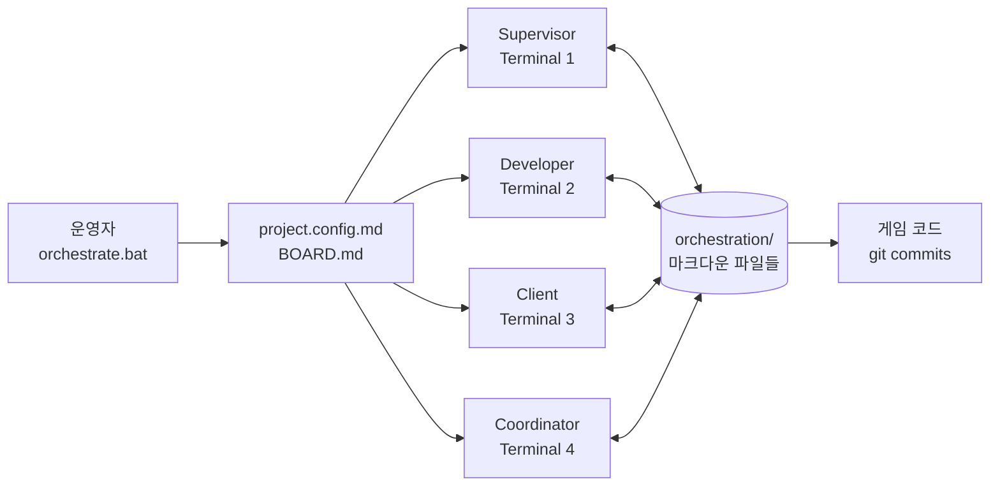

# Orchestration_general — 케이스 스터디 소스 자료

> 이 문서는 이력서·포트폴리오 양쪽에서 발췌해 쓰는 단일 소스다.
> 본문(Act 1~4)은 4박자 스토리, 부록(A~F)은 발췌용 토막이다.
> 스펙: `docs/superpowers/specs/2026-04-07-portfolio-source-material-design.md`
> 작성일: 2026-04-07

---

## 메타

| 항목 | 내용 |
|------|------|
| 프로젝트명 | Orchestration_general (Claude Orchestration Framework) |
| 한 줄 정의 | Claude CLI 4-에이전트 멀티 에이전트 오케스트레이션 프레임워크 |
| 개발 기간 | 2026-04-02 ~ 2026-04-07 (약 5일) |
| 검증 결과물 | GenWorld (Unity 2D RPG) — 약 5일 / **1143 커밋** / S-001~S-113 |
| 역할 | 단독 설계·구현·운영 (1인) |
| 사용 기술 | Claude CLI, Bash, Batch, PowerShell, Markdown, Mermaid, Git, Unity 2D / C# |
| GitHub | https://github.com/darkhtk/orchestration-general_00 · https://github.com/darkhtk/game-GenWorld |

---

# Act 1. 진행한 방향

## 출발 가설

처음 던진 질문은 단순했다. **"Claude CLI를 단일 세션이 아니라 여러 역할로 분리해서 자율 협업시키면, 사람이 매번 지시하지 않아도 게임 같은 복잡한 프로젝트를 끝까지 끌고 갈 수 있을까?"**

초기에는 단일 세션으로 시도했지만 두 가지 한계가 빠르게 드러났다. 첫째, 컨텍스트가 빠르게 오염되어 한 세션 안에서 구현·리뷰·관리를 동시에 시키면 어느 한 역할이 흐려졌다. 둘째, 사람이 매 단계 개입해야 하므로 "자율"이라 부를 수 없었다.

그래서 결정한 것은 **역할별 4 에이전트로 분리**하고, 인메모리 큐나 API 콜이 아니라 **파일 기반 비동기 메시징**을 단일 진실(single source of truth)로 삼는 것이었다. 각 에이전트는 별도 터미널에서 독립 루프를 돌고, 모든 의사소통과 상태는 마크다운 파일에 기록된다.

## 4 에이전트 역할 분담

| Agent | 역할 | 한 줄 책임 |
|-------|------|-----------|
| **Supervisor** | Orchestrator | 에셋 선제 생성, 코드 품질 감사, 런타임 에러 수정, 성능 최적화, UX 개선의 자동 행동 사이클 |
| **Developer** | Builder | 빌드/런타임 에러 점검 → 토론 응답 → 태스크 픽업 → 구현 → 리뷰 요청. RESERVE 비기 전엔 IDLE 금지 |
| **Client** | Reviewer | In Review 항목에 대한 다중 페르소나 QA 리뷰, APPROVE / NEEDS_WORK 판정 |
| **Coordinator** | Manager | 보드 동기화, 백로그 보충, 토론 진행, 오케스트레이션 시스템 자체 개선 (코드 수정 안함) |

## 첫 모양 — `orchestration/` 디렉터리

모든 상태가 프로젝트 루트의 `orchestration/` 디렉터리 안의 마크다운 파일에 기록된다. 핵심 파일은 다음과 같다.

- `BOARD.md` — Backlog → In Progress → In Review → Done의 칸반 보드
- `BACKLOG_RESERVE.md` — 개발자가 픽업할 태스크 풀
- `tasks/` — 개별 태스크 명세 (TASK-001.md, ...)
- `reviews/` — 리뷰 결과 (REVIEW-001-v1.md, ...)
- `specs/` — 기능 스펙
- `discussions/` — 에이전트 간 비동기 토론
- `logs/` — 에이전트별 루프 로그

모든 에이전트는 매 루프 시작 시 `BOARD.md`를 읽고, 자기 차례에 맞는 행동을 취한 뒤, 결과를 다시 마크다운에 적는다. **사람과 에이전트가 같은 포맷을 읽고 쓸 수 있으니 운영자가 언제든 끼어들 수 있다.** 이것이 이후 모든 운영 결정의 기반이 됐다.

## 아키텍처

[SCREENSHOT: 4개 터미널이 동시에 돌아가는 화면 — Windows Terminal 분할 또는 4창 띄우고 캡처]

[SCREENSHOT: `orchestration/` 디렉터리 트리 — VS Code 사이드바 또는 `tree` 명령 출력]

---

# Act 2. 이슈 발생

프레임워크의 첫 모양은 GenWorld 포팅(Phaser 3 TypeScript → Unity 2D C#)을 5일간 돌리면서 진짜 문제들을 만났다. 가장 큰 깨달음은 **"에이전트가 자율적으로 돈다"와 "운영 가능하다"는 다른 문제**라는 것이었다.

### 이슈 #1. 라이브 시스템을 안전하게 멈출 방법이 없음

- **증상:** 작업 중간에 4개 터미널을 Ctrl+C로 죽이면 BOARD 상태와 git working tree가 어긋남. 수동 테스트 윈도우(인게임 빌드를 직접 돌려보기)를 확보하기 위한 안전 정지 프로토콜이 없었음.
- **맥락:** GenWorld에서 인게임 동작을 직접 확인하고 싶을 때마다 반복.
- **단서:** 단일 커밋이 아니라 운영 패턴에서 드러난 이슈. 해결안 3-1의 도입이 단서.

### 이슈 #2. Windows에서 러너 스크립트가 CWD 문제로 깨짐

- **증상:** `.run_*.sh` 러너가 잘못된 작업 디렉터리에서 실행되어 파일을 찾지 못함.
- **맥락:** 프로젝트 루트가 아닌 곳에서 orchestrate.bat을 실행할 때.
- **단서:** 커밋 [`aad2d65`](https://github.com/darkhtk/orchestration-general_00/commit/aad2d65) — `fix: runner 스크립트 CWD 문제 수정`

### 이슈 #3. Resume 모드 파싱이 stdout에 잡음을 흘림

- **증상:** `Reconfigure` / `Resume` 분기 출력에 비ASCII 잡음이 섞여 자동화 파싱이 깨짐.
- **맥락:** 기존 orchestration이 있는 프로젝트에서 재시작할 때.
- **단서:** 커밋 [`2b253b6`](https://github.com/darkhtk/orchestration-general_00/commit/2b253b6) — `fix: clean resume mode parsing output`

### 이슈 #4. Loop runner가 조용히 죽음

- **증상:** 루프가 한 번 돌고 나서 다음 이터레이션으로 진입하지 못하고, 에러도 없이 멈춤.
- **맥락:** 장시간 운영 중 무작위로 발생.
- **단서:** 커밋 [`652d5f7`](https://github.com/darkhtk/orchestration-general_00/commit/652d5f7) — `fix: restore loop runners and config parsing`

### 이슈 #5. 도큐먼트가 부족한 프로젝트에 에이전트를 붙이면 잘못된 결정

- **증상:** README/현재 상태/우선순위 문서가 부재한 프로젝트에서 에이전트가 임의로 가정하고 작업했고, 잘못된 가정 위에 코드를 쌓았음.
- **맥락:** 신규 프로젝트 도입 시도.
- **단서:** 커밋 [`8602cef`](https://github.com/darkhtk/orchestration-general_00/commit/8602cef) — `docs: add preflight templates and lifecycle guide`

### 이슈 #6. 운영자가 매번 어떤 .bat을 실행해야 할지 헷갈림

- **증상:** orchestrate / monitor / manage-orchestration / test-orchestration / monitor-orchestration / add-feature 등 7개 .bat의 역할이 운영자에게 직관적이지 않음.
- **맥락:** 일상 운영 중 빈번.
- **단서:** 커밋 [`1cedb0d`](https://github.com/darkhtk/orchestration-general_00/commit/1cedb0d) — `feat: streamline orchestration entry and preflight`

---

이 6개 이슈가 모여서 **"자율 동작 자체"가 아니라 "운영 가능성·재현성·안전 정지"** 라는 다음 문제를 정의했다. 이후의 모든 설계 결정은 이 문제에 응답한 것이다.

---

# Act 3. 해결 방향

## 3-1. FREEZE / DRAIN_FOR_TEST 제어 플래그

- **진행한 방향:** 처음에는 4개 터미널을 직접 Ctrl+C로 죽이는 방식이었음. 작동은 하지만 운영 가능한 시스템이라 부를 수 없었음.
- **이슈 발생:** 이슈 #1. 작업 중간 강제 정지 시 BOARD 상태와 git working tree가 어긋나고, 수동 테스트 윈도우를 확보할 방법이 없었음.
- **해결 방향:** BOARD.md 상단에 두 종류의 **협력적 정지 플래그**를 두기로 결정. `FREEZE`는 즉시 정지(다음 루프 진입 차단), `DRAIN_FOR_TEST`는 현재 태스크를 안전 체크포인트까지 소화한 뒤 정지. 모든 에이전트가 매 루프 첫 줄(`Step 0: FREEZE 확인`)에서 이를 읽도록 프롬프트에 강제. 4개 에이전트 프롬프트 모두에 동일한 Control Flags 블록을 박아서 행동을 통일.
  - 대안 비교 — (a) **OS 시그널**: 멱등성/리커버리 없음, BOARD 상태 어긋남. (b) **단일 락 파일**: 안전 체크포인트와 즉시 정지의 의미 차이를 표현 못함. (c) **두 단계 협력적 플래그(채택)**: 사람·에이전트 양쪽이 같은 마크다운으로 의도를 표현 가능, 운영자가 손으로 BOARD를 편집해도 동작.
- **결과:** `manage-orchestration.bat` 한 번으로 라이브 시스템을 안전하게 멈춤·재개. GenWorld 운영 중 수동 인게임 테스트 윈도우 확보가 가능해졌고, 4개 터미널을 다시 띄울 필요가 없어짐.

## 3-2. Preflight 단계 + 템플릿 스캐폴드

- **진행한 방향:** 신규 프로젝트에 프레임워크를 붙일 때, 에이전트가 알아서 코드를 읽고 컨텍스트를 만들 거라 가정했음.
- **이슈 발생:** 이슈 #5. 도큐먼트 빈약한 프로젝트에서 에이전트는 추측으로 의사결정했고, 잘못된 가정 위에 코드를 쌓았음.
- **해결 방향:** 프레임워크 본 실행 앞에 **Preflight 단계**를 추가하고, `docs/templates/` 안에 4종 템플릿(`current-state` / `dev-priorities` / `testing` / `architecture`)을 미리 두어 자동 스캐폴드. 기존 파일은 절대 덮어쓰지 않음. 별도로 `PRE-FLIGHT-CHECKLIST.md`를 도입 가이드로 둠.
  - 대안 비교 — (a) **에이전트가 알아서 만들도록 프롬프트**: 매번 다른 결과, 재현성 없음. (b) **사용자가 수동으로 처음부터 채우도록 안내**: 진입 장벽 ↑, 도입 실패율 ↑. (c) **자동 스캐폴드 + 운영자 검토(채택)**: 비어 있어도 빈 칸의 위치가 명시되어 운영자 판단이 들어갈 자리를 만든다.
- **결과:** 신규 프로젝트 도입 시 첫 루프부터 에이전트가 일관된 컨텍스트를 갖고 시작. 커밋 [`8602cef`](https://github.com/darkhtk/orchestration-general_00/commit/8602cef)에서 템플릿과 라이프사이클 가이드 도입.

## 3-3. 6단계 라이프사이클 모델

- **진행한 방향:** 초기 모델은 "한 번 셋업하면 끝"이었음. 운영자가 무엇을 언제 해야 하는지 가이드 없음.
- **이슈 발생:** 이슈 #6의 일부. 일상 운영에서 어떤 행동이 어떤 단계에 속하는지 운영자에게 직관적이지 않았음.
- **해결 방향:** 프레임워크를 6단계 라이프사이클로 재정의 — **Preflight**(컨텍스트 정비) → **Bootstrap**(orchestrate 실행) → **Seed**(백로그 채우기) → **Operate**(자동 진행) → **Control**(FREEZE/DRAIN으로 조향) → **Test**(수동 검증). 각 단계가 어떤 도구를 쓰는지 README에 표로 정리.
  - 대안 비교 — (a) **단계 없는 자유 운영**: 진입 장벽 ↑, 운영자 시야 깨짐. (b) **더 많은 단계(8~10)**: 인지 부담 ↑. (c) **6단계(채택)**: "한 페이지 표"로 외우기에 적당한 인지 단위.
- **결과:** README와 entry hub가 모두 라이프사이클 어휘로 통일. 운영자가 "지금 나는 어느 단계에 있나"를 항상 알 수 있음.

## 3-4. 단일 Entry Hub `orchestration-tools.bat`

- **진행한 방향:** 도구가 늘어나면서 7개 이상의 .bat 파일이 생김 — orchestrate, monitor, manage, test, monitor-orchestration, add-feature 등.
- **이슈 발생:** 이슈 #6. 운영자(나 자신 포함)가 "지금 어떤 .bat을 실행해야 하지?"를 매번 헷갈림.
- **해결 방향:** 단일 진입점 `orchestration-tools.bat`을 만들고, 그 안에서 setup / monitor / control / test / runtime 모니터 / feature 추가 등 모든 일상 행동을 메뉴 형태로 제공. 개별 .bat은 "정확히 그 동작만 필요할 때"의 우회로로 남김.
  - 대안 비교 — (a) **.bat 파일을 더 잘게 쪼개기**: 인지 부담만 증가. (b) **자연어 CLI**: 구현 비용 + Windows 환경 이슈. (c) **메뉴 기반 hub(채택)**: 학습 비용 거의 0, 운영자가 다음 행동을 메뉴에서 발견 가능.
- **결과:** 신규 운영자가 `orchestration-tools.bat` 하나만 알면 일상 운영의 90%를 처리. README에서 "Recommended Entry Point"로 명시. 커밋 [`1cedb0d`](https://github.com/darkhtk/orchestration-general_00/commit/1cedb0d)에서 도입.

## 3-5. Windows 런타임 안정화 패치 묶음

- **진행한 방향:** 초기 러너 스크립트는 macOS/Linux 가정으로 짜여 있었고, Windows에서도 그냥 돌아갈 거라 기대했음.
- **이슈 발생:** 이슈 #2/#3/#4가 모두 Windows 환경 차이에서 발생 — CWD 처리, 비ASCII 출력, 조용히 죽는 루프 등.
- **해결 방향:** 한 묶음의 안정화 패치로 동시 대응.
  - (a) 러너 스크립트가 항상 자기 디렉터리 기준으로 동작하도록 CWD 명시 — [`aad2d65`](https://github.com/darkhtk/orchestration-general_00/commit/aad2d65)
  - (b) Resume 분기에서 stdout에 ASCII만 흐르도록 파싱 정리 — [`2b253b6`](https://github.com/darkhtk/orchestration-general_00/commit/2b253b6)
  - (c) Loop runner가 `Loop interval` 키를 안전하게 재파싱하고 fallback 처리 — [`652d5f7`](https://github.com/darkhtk/orchestration-general_00/commit/652d5f7)
  - (d) `project.config.md`에 ASCII-safe 키 네임 도입 (`Agent mode`, `Review level`, `Dev direction` 등)
  - 대안 비교 — (a) **WSL 강제**: 운영자 진입 장벽 ↑. (b) **환경별 별도 러너**: 유지보수 2배. (c) **안정화 패치(채택)**: 한 코드베이스로 양쪽 환경 지원.
- **결과:** Windows에서 동일한 러너 스크립트로 끊김 없는 장시간 운영 가능. README의 ASCII-safe 키 예시는 운영자에게 안정성 신호로 작동.

## 3-6. 10개 언어 README 확산 전략

- **진행한 방향:** README는 영어 한 벌만 있었음. 오픈소스 확산보다는 자기 작업 기록 용도였음.
- **이슈 발생:** 이슈 대응이 아닌 능동적 결정. **"이 프레임워크가 한국어/일본어/중국어 사용자에게 닿을 수 있다면, 그 자체가 멀티 에이전트 협업의 또 다른 검증이 된다"** 는 가설.
- **해결 방향:** 프레임워크 자체로 다국어 README를 생성. Coordinator 에이전트가 README.md → README.<lang>.md 번역을 태스크로 받아 처리. 한국어를 시작으로 일본어·중국어·스페인어·독일어·프랑스어·힌디어·태국어·베트남어까지 확장.
  - 대안 비교 — (a) **영어만 유지**: 확산 0. (b) **사람이 직접 번역**: 유지보수 폭발. (c) **프레임워크 자체로 번역(채택)**: 프레임워크의 dogfooding이자 메타 검증.
- **결과:** README 진입점이 **10개 언어(영어 + 9개 번역)** 로 분기. 한국어 사용자가 첫 클릭부터 모국어로 읽을 수 있음. 프레임워크의 "메타 결과물"로 포트폴리오에서 따로 어필 가능.

---

# Act 4. 결과 — GenWorld 검증

프레임워크의 진짜 검증은 그 프레임워크로 만든 결과물이다. `Orchestration_general`은 별도 프로젝트인 **GenWorld**(Unity 2D RPG)를 개발하면서 동시에 진화했다.

## 핵심 지표

| 지표 | 값 |
|------|-----|
| 게임 | GenWorld — Phaser 3 TypeScript RPG의 Unity 2D C# 포팅 |
| 기간 | 2026-04-02 ~ 2026-04-07 (약 5일) |
| 총 커밋 | **1143** |
| 보드 태스크 | **S-001 ~ S-113** |
| 운영 모드 | full (4 에이전트) |
| 엔진 | Unity 2D / URP / C# |

## 구현된 주요 시스템 (실제 파일 존재 검증됨)

| 시스템 | 파일 | 역할 |
|--------|------|------|
| **GameManager** | `Assets/Scripts/Core/GameManager.cs` | 게임 전체 상태·씬 흐름 관리 |
| **CombatManager** | `Assets/Scripts/Systems/CombatManager.cs` | 전투 파이프라인·데미지 계산 |
| **SkillSystem** | `Assets/Scripts/Systems/SkillSystem.cs` | 스킬 정의·사용·VFX 트리거 |
| **InventorySystem** | `Assets/Scripts/Systems/InventorySystem.cs` | 아이템 보관·획득·사용 |
| **QuestSystem** | `Assets/Scripts/Systems/QuestSystem.cs` | 퀘스트 수락·진행·보상 |
| **SaveSystem** | `Assets/Scripts/Systems/SaveSystem.cs` | 세이브/로드·진행 영속화 |

각 시스템은 EditMode 테스트로도 커버 — `Assets/Tests/EditMode/InventorySystemTests.cs`, `QuestSystemTests.cs`, `SaveSystemTests.cs`, `SkillSystemTests.cs` 등.

## 라이브 운영 신호 — 최근 커밋 인용

운영 5일차 시점의 실제 커밋 메시지(살아 있는 시스템의 가장 강력한 증거):

- `8a3156e` — fix: skill VFX pipeline + map collider alignment + area effect tick VFX
- `bf997ae` — fix: S-113 WorldEvent drop/gold multipliers never applied
- `ed5d554` — fix: S-112 items missing sell prices + ShopUI unsellable filter
- `914a4ad` — fix: ScreenFlash on player damage + ShopUI sell mode
- `b631604` — fix: XP bar updates on every kill, not just level-up
- `c02ac36` — chore: BOARD.md — S-109/110/111 DONE

태스크 ID(S-XXX)가 커밋 메시지에 자연스럽게 박혀 있는 것은 BOARD ↔ 코드 ↔ 커밋이 같은 태스크 어휘로 묶여 있다는 증거다.

## 프레임워크 자체의 재사용성

프레임워크는 GenWorld 전용이 아니다.

- **Unity / Godot / Unreal 자동 감지** — `.meta`/`Assets/`(Unity), `project.godot`(Godot), `*.uproject`(Unreal)을 보고 엔진을 판별하고 적절한 에러 로그 경로(Editor.log / Godot Output / Saved/Logs)를 자동 설정.
- **샘플 설정 동봉** — `sample-config/unity-2d-rpg.config.md`, `sample-config/godot-platformer.config.md`.
- **에이전트 운영 모드 3종** — `full` (4 에이전트) / `lean` (Developer + Supervisor 2 에이전트) / `solo` (1 에이전트). 프로젝트 규모에 따라 선택.

다른 게임 엔진/프로젝트로의 이식 가능성이 설계 단계부터 의도되었다.

## 배운 점 / 다음에 다르게 할 것

1. **에이전트는 자율보다 운영 가능성이 우선이다.** "혼자 잘 도는 것"보다 "사람이 언제든 끼어들 수 있는 것"이 더 어렵고 더 중요하다. FREEZE/DRAIN을 더 일찍 도입했어야 했다.

2. **마크다운은 LLM 협업의 좋은 단일 진실 매체다.** JSON/DB는 사람이 못 읽고, 자유 텍스트는 에이전트가 못 파싱한다. 마크다운(특히 표와 체크박스)은 양쪽 모두에게 1급 시민이다.

3. **Preflight 단계는 LLM 도입 전 모든 프로젝트에 필요하다.** "에이전트가 알아서 컨텍스트를 만들 것"이라는 가정이 가장 큰 운영 리스크였다.

4. **"운영자 인지 부담"은 코드 품질과 같은 1급 설계 변수다.** 7개 .bat이 있어도 운영자가 헷갈리면 시스템은 죽은 것이다. Entry Hub 도입 전후의 운영 경험 차이가 가장 큰 교훈.

[SCREENSHOT: GenWorld 인게임 — 전투 또는 NPC 상호작용 1~2장]

[SCREENSHOT: `orchestration/BOARD.md` 운영 중 캡처 — 칸반 컬럼이 채워진 모습]

[SCREENSHOT: `git log --oneline -20` 출력 — 활발한 커밋 라인]

---

# 부록 (발췌 재료)

## 부록 A. 헤드라인 카피 3종

**1줄용 (이력서 경력 한 줄, 30~50자):**

> Claude CLI 4-에이전트 오케스트레이션 프레임워크 설계·구현, Unity 2D RPG 1143 커밋으로 검증

**2~3줄용 (이력서 프로젝트 요약, 80~150자):**

> Claude CLI 기반 4-에이전트(Supervisor / Developer / Client / Coordinator) 멀티 에이전트 오케스트레이션 프레임워크를 단독 설계·구현. 파일 기반 비동기 메시징, FREEZE/DRAIN 안전 제어, 6단계 라이프사이클을 갖춘 운영 가능한 시스템. 약 5일 / 1143 커밋의 Unity 2D RPG로 실증.

**1문단용 (포트폴리오 표지 또는 about, 200~300자):**

> Orchestration_general은 Claude CLI를 4개의 역할별 에이전트로 분리하고 마크다운 파일을 단일 진실로 삼아, 사람이 매번 지시하지 않아도 게임 같은 복잡한 프로젝트를 끝까지 끌고 가도록 만든 멀티 에이전트 오케스트레이션 프레임워크다. "자율 동작 자체"보다 "운영 가능성·재현성·안전 정지"를 핵심 설계 가치로 두었으며, FREEZE/DRAIN 협력적 정지 플래그, Preflight 단계, 6단계 라이프사이클, 단일 Entry Hub 등의 결정을 거쳐 실제 운영 가능한 시스템으로 진화했다. 검증 결과물인 GenWorld(Unity 2D RPG)는 약 5일 동안 1143 커밋 / S-001~S-113까지의 보드 태스크가 자동 흐름으로 처리되며 살아있는 시스템임을 증명한다.

---

## 부록 B. 핵심 지표 Quant Block

검증 가능한 정량 지표만 모은 발췌용 블록.

- **에이전트 수:** 4 (Supervisor / Developer / Client / Coordinator)
- **에이전트 운영 모드:** 3종 (full / lean / solo)
- **자동 감지 게임 엔진:** 3종 (Unity / Godot / Unreal)
- **다국어 README:** 10개 언어 (영어 원본 + 한국어/일본어/중국어/스페인어/독일어/프랑스어/힌디어/태국어/베트남어 9개 번역)
- **라이프사이클 단계:** 6 (Preflight → Bootstrap → Seed → Operate → Control → Test)
- **검증 게임 (GenWorld):**
  - 기간: 약 5일 (2026-04-02 ~ 2026-04-07)
  - 총 커밋: **1143**
  - 보드 태스크: **S-001 ~ S-113** (113 태스크)
  - 주요 시스템 수: 6+ (GameManager, CombatManager, SkillSystem, InventorySystem, QuestSystem, SaveSystem)
  - EditMode 테스트: 4종 시스템(Inventory/Quest/Save/Skill)에 대한 단위 테스트 존재
- **단독 작업:** 1인 (설계·구현·운영 전부)

---

## 부록 C. 이력서 발췌 bullet

이력서에 그대로 붙일 수 있도록 길이별로 준비. 회사·지원 직무에 따라 골라 쓴다.

**짧은 형식 (15~30자):**

- Claude CLI 멀티 에이전트 오케스트레이션 프레임워크 단독 설계·구현
- 4-에이전트 파일 기반 비동기 협업 시스템 구축
- Unity 2D RPG 5일·1143 커밋 자동 출고

**중간 형식 (30~60자):**

- Claude CLI 4-에이전트 오케스트레이션 프레임워크를 단독 설계·구현하여 Unity 2D RPG 1143 커밋(S-001~S-113)으로 검증
- 마크다운 파일 기반 비동기 메시징과 BOARD.md 칸반으로 사람·에이전트가 같은 단일 진실을 공유하는 협업 프로토콜 설계
- FREEZE / DRAIN_FOR_TEST 협력적 정지 플래그를 도입해 라이브 멀티 에이전트 시스템의 안전 정지·수동 테스트 윈도우 확보
- Preflight 단계 + 4종 템플릿 자동 스캐폴드로 신규 프로젝트의 LLM 도입 진입 장벽 제거

**긴 형식 (60~100자):**

- Claude CLI를 역할별 4 에이전트(Supervisor / Developer / Client / Coordinator)로 분리하고 파일 기반 비동기 메시징으로 협업시키는 오케스트레이션 프레임워크를 단독 설계·구현, Unity 2D RPG GenWorld 약 5일 / 1143 커밋으로 실증
- Preflight → Bootstrap → Seed → Operate → Control → Test 6단계 라이프사이클 모델과 단일 Entry Hub를 도입해 멀티 에이전트 시스템의 자율 동작과 운영 가능성을 동시에 달성
- Unity / Godot / Unreal 자동 감지, 10개 언어 README, ASCII-safe Windows 런타임 안정화 패치를 포함한 범용 게임 개발 오케스트레이션 도구로 발전시킴

---

## 부록 D. 코드 큐레이션

이 프로젝트를 평가할 때 가장 먼저 봐주면 좋을 파일들. 면접 시 화면을 띄워놓고 설명하기 좋은 순서로 정리.

**프레임워크 (Orchestration_general):**

| 파일 | 한 줄 설명 |
|------|-----------|
| [`README.md`](https://github.com/darkhtk/orchestration-general_00/blob/main/README.md) | 프레임워크 전체 그림 — 4 에이전트, 6단계 라이프사이클, 운영 모델이 한 페이지에 모여 있음 |
| [`framework/prompts/COORDINATOR.txt`](https://github.com/darkhtk/orchestration-general_00/blob/main/framework/prompts/COORDINATOR.txt) | 매니저 역할 에이전트의 루프 프롬프트 — BOARD 동기화/충돌 결론/태스크 발행 |
| [`framework/prompts/DEVELOPER.txt`](https://github.com/darkhtk/orchestration-general_00/blob/main/framework/prompts/DEVELOPER.txt) | 빌더 역할 에이전트의 루프 프롬프트 — 태스크 픽업/구현/리뷰 요청 |
| [`framework/prompts/SUPERVISOR.txt`](https://github.com/darkhtk/orchestration-general_00/blob/main/framework/prompts/SUPERVISOR.txt) | 오케스트레이터 에이전트 — 에셋 생성/품질 감사/보드 관리 |
| [`framework/prompts/CLIENT.txt`](https://github.com/darkhtk/orchestration-general_00/blob/main/framework/prompts/CLIENT.txt) | 다중 페르소나 QA 리뷰어 — APPROVE/NEEDS_WORK 판정 |
| [`orchestrate.bat`](https://github.com/darkhtk/orchestration-general_00/blob/main/orchestrate.bat) | 메인 진입점 — 의존성 체크 + 폴더 선택 + 엔진 감지 + 셋업 + 런치 |
| [`orchestration-tools.bat`](https://github.com/darkhtk/orchestration-general_00/blob/main/orchestration-tools.bat) | 단일 운영자 hub — 일상 운영의 90%가 여기 메뉴 안에 있음 |
| [`auto-setup.sh`](https://github.com/darkhtk/orchestration-general_00/blob/main/auto-setup.sh) | 인터랙티브 셋업 본체 — 엔진 감지 + 설정 생성 + 프롬프트 발행 |

**검증 결과물 (Gen / GenWorld):**

| 파일 | 한 줄 설명 |
|------|-----------|
| [`PROJECT_BRIEF.md`](https://github.com/darkhtk/game-GenWorld/blob/main/PROJECT_BRIEF.md) | GenWorld 프로젝트 개요 — 무엇을 왜 어떻게 만들었나 |
| [`Assets/Scripts/Core/GameManager.cs`](https://github.com/darkhtk/game-GenWorld/blob/main/Assets/Scripts/Core/GameManager.cs) | 게임 전체 상태·씬 흐름 관리 |
| [`Assets/Scripts/Systems/CombatManager.cs`](https://github.com/darkhtk/game-GenWorld/blob/main/Assets/Scripts/Systems/CombatManager.cs) | 전투 파이프라인 |
| [`orchestration/BOARD.md`](https://github.com/darkhtk/game-GenWorld/blob/main/orchestration/BOARD.md) | 라이브 보드 — 진행 중인 칸반 컬럼 |

---

## 부록 E. 링크 모음

**GitHub 레포:**

- 프레임워크: <https://github.com/darkhtk/orchestration-general_00>
- 검증 게임 GenWorld: <https://github.com/darkhtk/game-GenWorld>

**핵심 한국어 자료:**

- [README.ko.md](https://github.com/darkhtk/orchestration-general_00/blob/main/README.ko.md) — 한국어 README

**핵심 커밋 (Act 2 / Act 3 인용):**

- [`aad2d65`](https://github.com/darkhtk/orchestration-general_00/commit/aad2d65) — fix: runner 스크립트 CWD 문제 수정
- [`2b253b6`](https://github.com/darkhtk/orchestration-general_00/commit/2b253b6) — fix: clean resume mode parsing output
- [`652d5f7`](https://github.com/darkhtk/orchestration-general_00/commit/652d5f7) — fix: restore loop runners and config parsing
- [`8602cef`](https://github.com/darkhtk/orchestration-general_00/commit/8602cef) — docs: add preflight templates and lifecycle guide
- [`d023986`](https://github.com/darkhtk/orchestration-general_00/commit/d023986) — feat: add orchestration operations and test controls
- [`1cedb0d`](https://github.com/darkhtk/orchestration-general_00/commit/1cedb0d) — feat: streamline orchestration entry and preflight

---

## 부록 F. 캡처 슬롯 일람

본인이 직접 캡처해서 넣을 자리. 본문 위치별로 정리.

| 위치 | 캡처 내용 | 권장 도구 |
|------|----------|----------|
| Act 1 끝 | 4개 터미널이 동시에 돌아가는 화면 | Windows Terminal 분할 또는 4창 띄우고 Snipping Tool |
| Act 1 끝 | `orchestration/` 디렉터리 트리 | VS Code 사이드바 또는 `tree` 명령 출력 |
| Act 4 끝 | GenWorld 인게임 (전투 또는 NPC 상호작용) 1~2장 | Unity Editor 게임 뷰 캡처 |
| Act 4 끝 | `orchestration/BOARD.md` 운영 중 캡처 | VS Code 마크다운 프리뷰 |
| Act 4 끝 | `git log --oneline -20` 출력 | 터미널 캡처 |

**선택 사항 (있으면 더 좋음):**

- Act 1의 Mermaid 다이어그램을 GitHub에서 렌더한 화면을 이미지로 내려받아 PDF에 박기
- README.ko.md의 GitHub 페이지 캡처 (다국어 진입점 강조용)
- `orchestration-tools.bat` 메뉴 화면 캡처 (Entry Hub 어필용)
